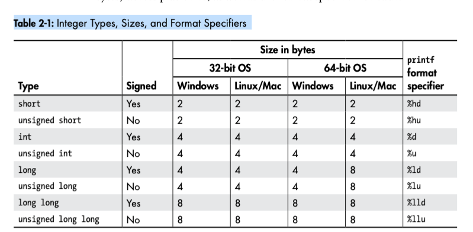
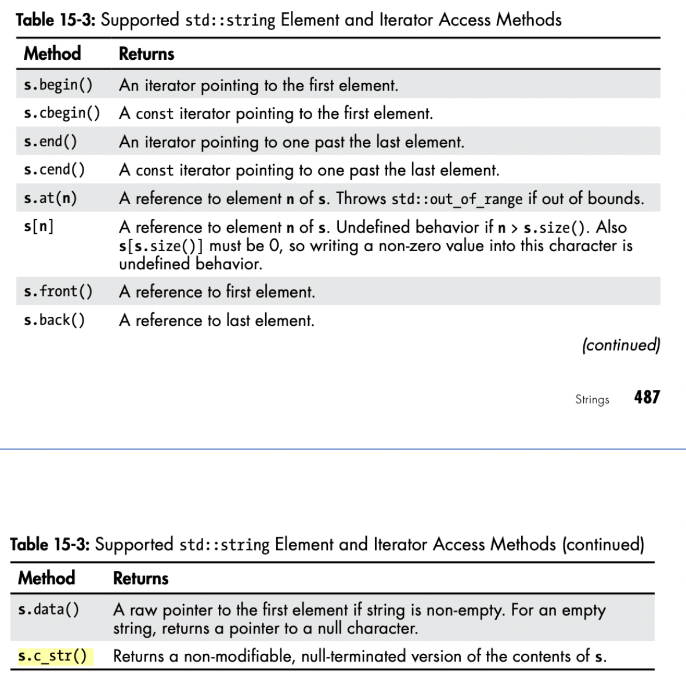
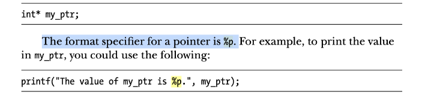

# C++ 编程笔记 01

## 教材视频参考:

- 视频
  - CodeBeauty 10-hours
- 教材
  - cpp Crash
  - cpp primer
- 参考网站
  - W3C School
  - G4G

# 01 变量类型

# 变量

变量就是存储整型、浮点、双精度、字符串、布尔值、指针、数组等数据的有上限的容器。

- 一个变量容器只能存储一类容器
- 一旦确定了数据类型，就不能再改变
- 大小写敏感
  - **myVariablel != myvariable**

## 全局变量 静态变量 常量 

存储在内存 全局区中。

## printf 格式化输出

printf 函数称为格式输出函数，其关键字最末一个字母 f 即为“格式”(format)之意。按照用户指定的格式（占位符），把指定的数据显示到屏幕上。

|        type        | examples | printf format specifiers |    etc     |
| :----------------: | :------: | :----------------------: | :--------: |
|       string       |          |            %s            | .to_cstr() |
|       short        |          |           %hd            |            |
|   unsigned short   |          |           %hu            |            |
|        int         |          |            %d            |            |
|    unsigned int    |          |            %u            |            |
|        long        |          |           %ld            |            |
|     long long      |          |           %lld           |            |
| unsigned long long |          |           %llu           |            |

The format specifier for a byte is %zd.
The format specifier %f displays a float with decimal digits, whereas %e displays the same number in scientific notation.

## 未完待续

[关于输出函数详解](http://c.biancheng.net/cpp/html/33.html)

# 数据类型

# 介绍

- 静态类型
  - 有利于工具做静态分析，有利于性能优化，有利于代码可读性。
  - 动态类型一时爽，代码重构火葬场
  - 各有所长，保持敬畏

# 数据类型

C++中常见的数据类型.

操作系统会根据变量的数据类型，来分配内存和决定在保留内存中存储什么，比如字符型、宽字符型、整型、浮点型、双浮点型、布尔型等

|        类型        | 位（字节数）  |                                范围                                 |
| :----------------: | :-----------: | :-----------------------------------------------------------------: |
|        bool        |       1       |                               0 和 1                                |
|        char        |       1       |                      -128 到 127 或者 0 到 255                      |
|   unsigned char    |       1       |                              0 到 255                               |
|    signed char     |       1       |                             -128 到 127                             |
|        int         |       4       |                      -2147483648 到 214748364                       |
|    unsigned int    |       4       |                           0 到 4294967295                           |
|     signed int     |       4       |                      -2147483648 到 2147483647                      |
|     short int      |       2       |                           32768 到 32767                            |
| unsigned short int |       2       |                             0 到 65,535                             |
|  signed short int  |       2       |                           -32768 到 32767                           |
|      long int      |       8       |       -9,223,372,036,854,775,808 到 9,223,372,036,854,775,807       |
|  signed long int   |       8       |       -9,223,372,036,854,775,808 到 9,223,372,036,854,775,807       |
| unsigned long int  |       8       |                   0 到 18,446,744,073,709,551,615                   |
|       float        |       4       |   精度型占 4 个字节（32 位）内存空间，+/- 3.4e +/- 38 (~7 个数字)   |
|       double       |       8       | 双精度型占 8 个字节（64 位）内存空间，+/- 1.7e +/- 308 (~15 个数字) |
|    long double     |      16       |  长双精度型 16 个字节（128 位）内存空间，可提供 18-19 位有效数字。  |
|      wchar_t       | 2 或 4 个字节 |                             1 个宽字符                              |

注意，各种类型的存储大小与系统位数有关，但目前通用的以 64 位系统为主。

## 计算结果超出数据类型元算所能表示的范围时产生溢出，溢出后像是过了半夜十二点从头开始

like:
The value of intMax is 2147483647
The value of intMax + 1 is -2147483648

# 带符号类型和无符号类型

有符号（signed）也就是该整型可以表示正数也可以表示负数，而无符号（unsigned）则表示该整数只能表示正数，不能表示负数。

- signed 存储符号是有代价的，代价就是存储空间中的一个比特位专门用来存储符号，这一位不能表示数值。

- 一般来说，同类型的 signed 能够存储的数的绝对值大小要小于 unsigned。

- 在我们定义变量时，如果没有显式声明是 signed 还是 unsigned，那么默认就是 signed。

# 数据类型的重要性

数据类型对程序非常重要，如果使用了错误的类型，程序可能会出错，或者程序可能会出现不可预料的结果。

所以在我们编程时，第一件事就是必须清楚，我们要使用的数据类型。
