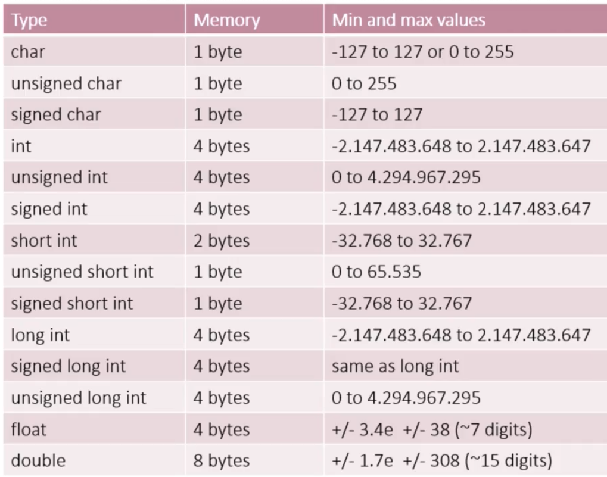
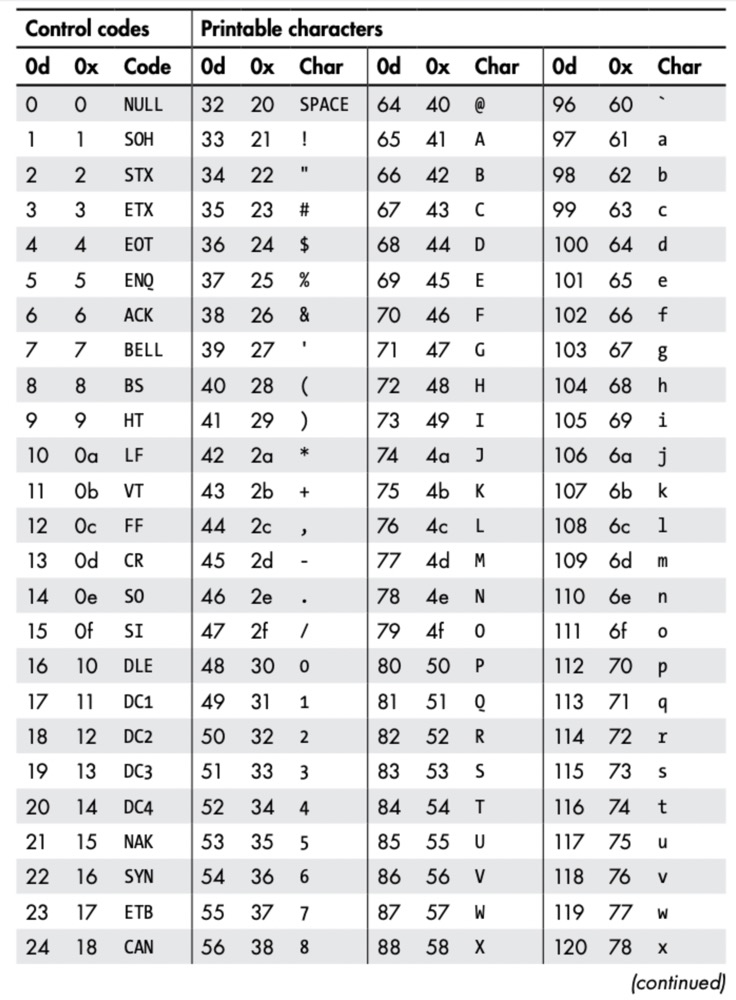
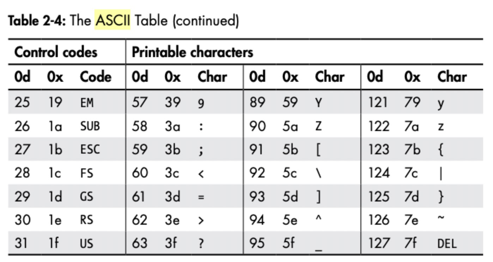
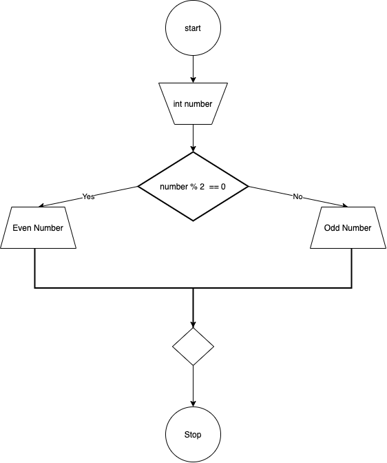
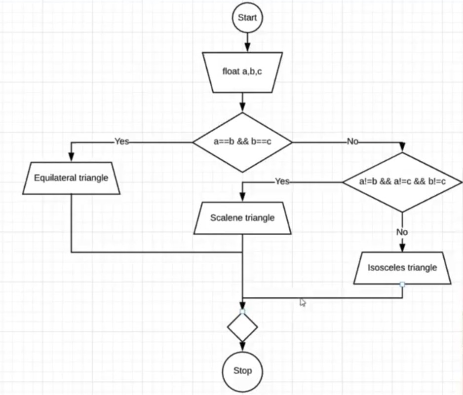
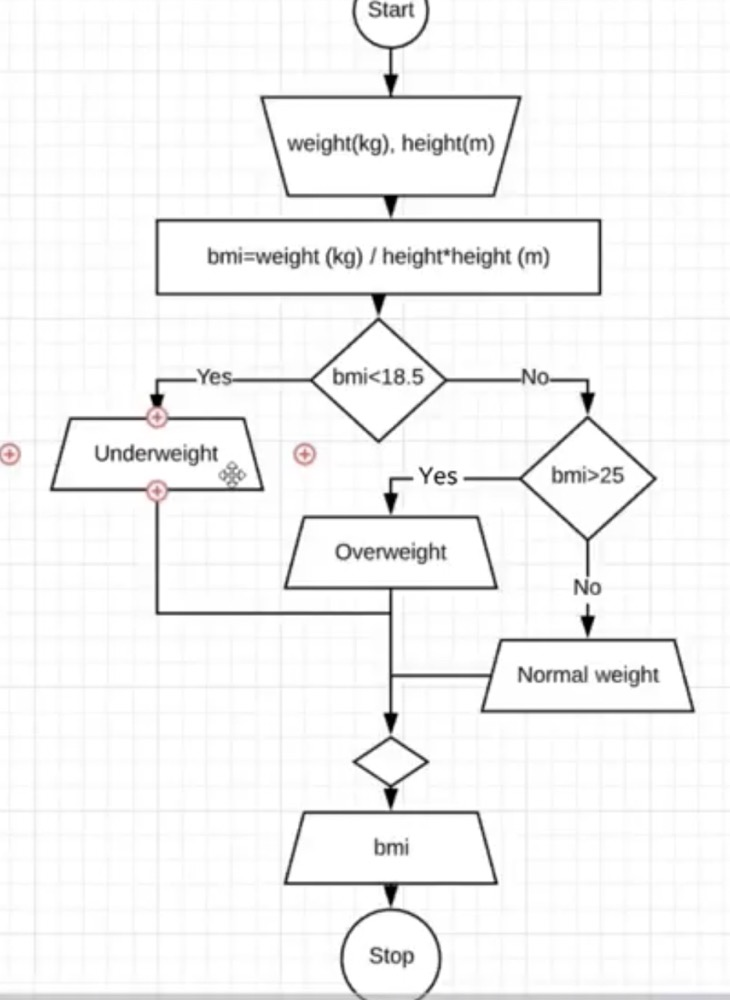
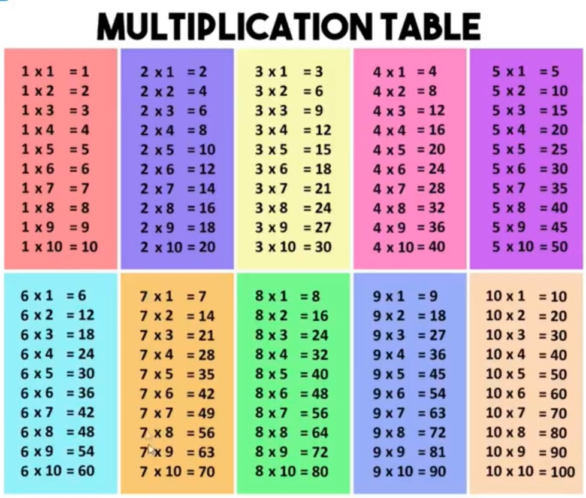
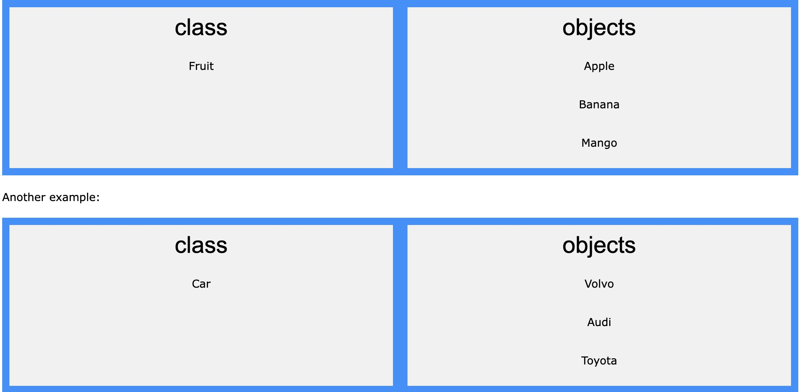
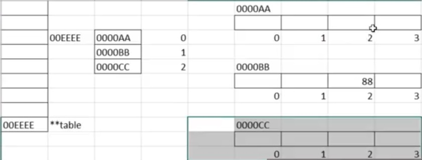

# cpp Notes 0

## Tutorial:

- CodeBeauty 10-hours

## Books:

- cpp Crash
- cpp primer

## Ref:

- W3C School
- G4G

# Chapter 1 Intro,Variables, Datatypes

### General purpose

- Create all types of programs
- Compiled
  - Converting code that you understand into code that your computer understands
  - Building code
  - Compile-time errors
- Case sensitive
  - cppdistinguishes between uppercase and lowercase letters
  - **myVariablel != myvariable**

## Variales

Variales: store **`int float double char string bool`** with maxium limit container.

- Can NOT store different datatypes in one varialble
- Can NOT change the datatype once you created

```c++
#include <iostream>
using namespace std;

int main(){
    float annualSalary = 50000.99;
    float monthlySallary = annualSalary / 12;
    cout << "Annual salary: " << annualSalary << endl;
    cout << "Your monthly salary is : " << monthlySallary << endl;
}
```

```c++
#include <iostream>
using namespace std;

int main(){
    float annualSalary = 500000;
    float monthlySallary = annualSalary / 12;
    cout << "Annual salary: " << annualSalary << endl;
    cout << "Your monthly salary is : " << monthlySallary << endl;
}
```

- cin ： input from users.

```c++
#include <iostream>
using namespace std;

int main()
{
float annualSalary;
cout << "Please enter your annual salary:\n";
cin >> annualSalary;
float monthlySallary = annualSalary / 12;
cout << "Annual salary: " << annualSalary << endl;
cout << "Your monthly salary is : " << monthlySallary << endl;
}
```

Let pc compute the income in 10 years

```c++
#include <iostream>
using namespace std;

int main()
{
float annualSalary;
cout << "Please enter your annual salary:\n";
cin >> annualSalary;
float monthlySallary = annualSalary / 12;
cout << "Annual salary: " << annualSalary << endl;
cout << "Your monthly salary is : " << monthlySallary << endl;
cout << "In 10 years you will earn:" << annualSalary * 10 << endl;
}
```

## Datatypes

Most common datatypes we use in cpp.

```c++
#include <climits>
#include <iostream>
using namespace std;

int main() { //most common datatypes we use in cpp
  int yearOfBirth = 1995;
  char gender = 'm';
  bool isOlderThan18 = true;
  float averageGrade = 4.5;
  double balance = 452345234;


  cout << "Int min value is " << INT_MIN << endl;
  cout << "Int max value is " << INT_MAX << endl;
  cout << "Uint max value is " << UINT_MAX << endl;

  cout << "Size of char is " << sizeof(char) << "bytes\n";
  cout << "Size of unsinged int is " << sizeof(unsigned int) << " bytes\n";
  cout << "Size of int is " << sizeof(int) << " bytes\n";
  cout << "Size of float is " << sizeof(float) << " bytes\n";
  cout << "Size of double is " << sizeof(double) << " bytes\n";

}

```

The following table shows the variable type, how much memory it takes to store the value in memory, and what is maximum and minimum value which can be stored in such type of variables.



## Datatype overflow

```c++
#include <iostream>
using namespace std;

int main() { // max amount of INT
  int intMax = INT_MAX;
  cout << intMax << endl;
  cout << intMax + 1 << endl;

}
```

It actually works like the clock when it is over INT_MAX, then it goes to the INT_MIN.

### Datatype importance

**The datatype is critical to the program**. If you use the wrong datatype, the program will not work, or in worse,the program will give you wired result.

**So, when we are coding ,the first thing we must make clear is the datatype we are using**.

### ASCII Program

```c++
#include <iostream>
using namespace std;

int main() {
  cout << (int)'a' << endl;
  cout << int('a') << endl;
  cout << int('A') << endl;
}
```

The $\textit{American Standard Code for Information Interchange (ASCII)}$ table assigns integers to characters. Table 2-4 shows the ASCII table. For each integer value in decimal (0d) and hex (0x), the given control code or printable character is shown.





```c++

```

So， you can build an app to cipher or decipher words and ASCII codes.

```c++
#include <iostream>
using namespace std;

int main() {
  char c1, c2, c3, c4, c5;
  cout << "Enter 5 letters:";
  cin >> c1 >> c2 >> c3 >> c4 >> c5;

  cout << "ASCII message:" << int(c1) << " " << int(c2) << " " << int(c3) << " "
       << int(c4) << " " << int(c5) << endl;
  // " " is the blankspace character
}

```

```c++
#include <iostream>
using namespace std;

int main() {
  char c1, c2, c3, c4, c5;
  cout << "Enter 5 ASCII numbers:";
  cin >> c1 >> c2 >> c3 >> c4 >> c5;

  cout << "The message:" << char(c1) << " " << char(c2) << " " << char(c3)
       << " " << char(c4) << " " << char(c5) << endl;
  // " " is the blankspace character
}

```

# Chapter 2 If-else statements

## Operators

Operators in cpp can be classified into 6 types:

Arithmetic Operators
Assignment Operators
Relational Operators
Logical Operators
Bitwise Operators // not in in note ver 0.1
Other Operators // not in in note ver 0.1

### Arithematic operators: +, -, \*, /, % (modulus)

First of all ,we need to know how the computer to calculate the result.

```c++

#include <iostream>
using namespace std;

int main() {
  cout << 5 + 2 << endl;
  cout << "5 / 2 = " << 5 / 2 << endl; // take care!
  cout <<"5.0 / 2 = " <<  5.0 / 2 << endl; // take care!
  cout <<"5 / 2.0 = " <<  5 / 2.0 << endl;//take care!
  cout << "5 % 2 = " << 5 % 2 << endl; // modulus operator
  cout << "47 % 10 = " <<47 % 10 << endl; // modulus operator
}
```

**Here we notice that 5 / 2 = 2 since cpp returns the integer value of the division.If you want to get the decimal value, you need to change the type of the divisor or dividend to float.**

- Increment/decrement operators ++ --
  Increment/decrement operators increment or decrement the value of the object.

  Pre-increment `++a` and pre-decrement `--a` operators increments or decrements the value of the object and returns a reference to the result.

Post-increment `a++` and post-decrement `a--` creates a copy of the object, increments or decrements the value of the object and returns the copy from before the increment or decrement.

```c++
#include <iostream>
using namespace std;

int main() {
  // ++,-- increment and decrement operators
  int counter = 7;
  counter++;
  cout << counter << endl;
  counter--;
  cout << counter << endl;
  // preincrement, predecrement
  // postincrement, postdecrement
  int counter_2 = 7;
  cout << counter_2++ << endl; // shows 7 which is the value before increment
  cout << counter_2 << endl; // Next, shows 8 which is the value after increment
  cout << counter_2--
       << endl; // shows 8 which is the value before decrement,yes, counter_2 is 8 now becasue of previous increment.
  cout << counter_2 << endl; // Next, shows 7 which is the value after decrement
}
```

### Relational operators: <, >, <=, >=, ==(just is equal to operator), !=

```c++
#include <iostream>
using namespace std;

int main()
{
int a = 6, b = 5;
cout << (a > b ) << endl; // shows 1 for true
cout << (a < b)  << endl; // shows 0 for false
cout << (a >= b) << endl; // shows 0 for false
cout << (a <= b) << endl; // shows 1 for true
cout << (a == b) << endl; // shows 0 for false
cout << (a != b) << endl; // shows 1 for true
}

```

### Logical Operators &&(AND), ||(OR), !(NOT)

Logical operators evaluate Boolean logic on bool types. You characterize operators by how many operands they take. A unary operator takes a single operand, a binary operator takes two, a ternary operator takes three, and so on. You categorize operators further by describing the types of their operands.

- The unary negation operator `!` takes a single operand and returns its opposite. In other words, !true yields false, and !false yields true.
- The logical operators AND `&&` and OR `||` are binary.
- Logical AND returns true only if both of its operands are true. Logical OR returns true if either or both of its operands are true.

```c++
#include <iostream>
using namespace std;

int main()
{
int a = 6, b = 5;
cout << (a == 5 && b ==5) << endl; // AND operator,shows 0 for false
cout << (a == 5 || b ==5) << endl; // OR operator,shows 1 for true
// JUST add a '!' to the front of the operator to get the opposite result
cout << (!(a == 5 && b ==5)) << endl; // NOT operator,shows 1 for true
}
```

- Operator priority

  Arithmetic operators >> relation operators >> logical operators

```c++
#include <iostream>
using namespace std;

int main()
{
int x = 6, y = 8;
cout << (x ==6 && y == 5 +3) << endl; // calculates 5+3 first, then checks  whether x==6 , y== 8 seperately, at last, make sure they are BOTH true, shows 1 for true.

}
```

### Assignment operators: `=, +=, -=, \*=, /=, %=, <<=, >>=, &=, |=, ^=`

```c++
#include <iostream>
using namespace std;

int main() {
  int x =5;
  x +=7; // x = x + 7 (equals to 12)
  cout << x << endl;
  // -= is the same as x = x - 7

}

```

### Later, check [**cpp Operator Precedence Table**](https://en.cppreference.com/w/cpp/language/operator_precedence) for more information.

### How to swap 2 variables values?

Let's code:

```c++
#include <iostream>
using namespace std;

int main() {
  // Program to swap two variables values
  int a = 20, b = 10;
  int temp = a; // hold the value of a in temp
  a = b;        // assign the value of b to a
  b = temp;     // assign the value of temp to b
  cout << "a = " << a << endl;
  cout << "b = " << b << endl;
  // Also, we can make it without using the third container, instead, we will
  // handle it in a mathmatic way:
  int x = 20, y = 10;
  x = x + y; // now x stores the sum of x and y which is 30
  y = x - y; // the NEW x subtracts the value of y ITSELF, which is 20, now we
             // get y value swapped
  x = x - y; // the NEW x subtracts NEW y, in the end x value got swapped which
             // is 10.
  cout << "x = " << x << endl;
  cout << "y = " << y << endl;
}
```

## If-else statements

- If-else statements
- conditional operator (0?1:2)
- Switch case statements

```c++
#include <iostream>
using namespace std;

// User enters integer number
// Program write out if that number is even or odd

int main() { cout << 10 % 3 << endl; }

```

with the modulo operator,we can make the function with the flowchart:



```c++
#include <iostream>
using namespace std;

// User enters integer number
// Program write out if that number is even or odd

int main() {
  int number;                 // declare the number variable.
  cout << "Enter a number: "; // Hint the user to enter a number.
  cin >> number;              // get the number from the user.
  // determine if the number is even or odd
  if (number % 2 == 0)
  // notice the curly brackets which shows the next operation if number % 2 == 0
  {
    cout << "You entered an even number." << endl;
  } else

  // otherwise, the number is odd, notice the coding style.
  {
    cout << "You entered an odd number." << endl;
  }
  cout << "Thank you for using the program!" << endl;
}
```

Review this code carefully and notice hwo to code if-else statement.

Let's get it more complex.
Determine whether a triangle is equilateral,isosceles or scalene.



```c++
#include <iostream>
using namespace std;

int main() {
  // User enters side lengths of a triangle (a,b,c)
  // Program should write out whether that triangle is equilateral,isosceles or
  // scalene
  float a, b, c;
  cout << "Enter the length of the triangle's each side a,b,c:";
  cin >> a >> b >> c;
  if (a == b && b == c) // Here I hide the curly brackets for better readability.
    cout << "The triangle is equilateral.\n";
  else {
    if (a != b && b != c && a != c) {
      cout << "The triangle is scalene.\n";
    } else {
      cout << "The triangle is isosceles.\n";
    }
  }
}
```

### From BMI Calulator to algorithm design

There are 3 thresholds for BMI:
// Underweight 18.5
// Normal weight 18.5-24.9
// Overweight >25

So with the if-else statement, we can design the algorithm with the condition:

1. if <= 18.5
2. if>= 25
3. else



as we see in the plot, we can make the "Break points" with 18.5 and 25 to reduce steps.

```c++
#include <iostream>
using namespace std;

int main() {
  // BMI calculator
  // weight(kg)/height * height(m)
  // Underweight 18.5
  // Normal weight 18.5-24.9
  // Overweight >25
  float weight, height, bmi; // bmi = weight(kg)/height * height(m)
  cout << "Enter your weight(kg): ";
  cin >> weight;
  cout << "Enter your height(m): ";
  cin >> height;
  bmi = weight / (height * height); // essential brackets

  // this if else statement is more precise:
  if (bmi < 18.5)
    cout << "you are underweight" << endl;
  else if (bmi > 25)
    cout << "you are overweight" << endl;
  else
    cout << "you are normal weight" << endl;

  cout << "Your BMI is: " << bmi << endl;
}

```

```c++

```

### Codidtional Operators (0 ? 1 : 2) : short version of if-else statement

IN cpp :

```c++
Exp1 ? Exp2 : Exp3;
```

Exp1, Exp2, and Exp3 are expressions. Notice the use and placement of the **colon**.

The **value of a ? expression** is determined like this: Exp1 is evaluated. If it is true, then Exp2 is evaluated and becomes the value of the entire ? expression. If Exp1 is false, then Exp3 is evaluated and its value becomes the value of the expression.

The **? is called a ternary operator** because it requires three operands and can be used to replace if-else statements.

```c++
#include <iostream>
using namespace std;

int main() {
  int hostUserNum, guestUserNum;
  cout << "Enter a host number: ";
  cin >> hostUserNum;
  system("clear");
  cout << "Enter a guest number: ";
  cin >> guestUserNum;

  if (guestUserNum == hostUserNum)
    cout << "Correct." << endl;
  else
    cout << "Failed." << endl;
}

```

Now lets take a look at the short version:
condicion ? expresion1 : expresion2

```c++
#include <iostream>
using namespace std;

int main() {
  int hostUserNum, guestUserNum;
  cout << "Enter a host number: ";
  cin >> hostUserNum;
  system("clear");
  cout << "Enter a guest number: ";
  cin >> guestUserNum;
    (guestUserNum == hostUserNum)? cout << "Correct." :cout << "Failed.";
}

```

Also, we can upgrade the function with loops later.

### From if-else statement to swich case statement

Now let's build a calculator with if-else statement.

```c++
#include <iostream>
using namespace std;

int main() {
  float num1, num2;
  char operatorCalc;
  cout << "Please enter the number and operator: " << endl;
  cin >> num1 >> operatorCalc >> num2;
  if (operatorCalc == '+')
    cout << num1 + num2 << endl;
  else if (operatorCalc == '-')
    cout << num1 - num2 << endl;
  else if (operatorCalc == '*')
    cout << num1 * num2 << endl;
  else if (operatorCalc == '/')
    cout << num1 / num2 << endl;
  // else if (operatorCalc == '%')
  //   cout << int(num1) % int(num2)
  //        << endl;
  // caution: only modulo the intergers.
  else
    cout << "Invalid operator" << endl;
}
```

Cool calculator, and you got hinted that **the modulo integers ONLY**,you made it, now let's introduce the switch case statement.

This is the formal version of the switch case statement:

```c++
switch (expression)  {
    case constant1:
        // code to be executed if
        // expression is equal to constant1;
        break;

    case constant2:
        // code to be executed if
        // expression is equal to constant2;
        break;
        .
        .
        .
    default:
        // code to be executed if
        // expression doesn't match any constant
}
```

Where the expression is corresponding to constantX.

#### Why switch case statement?

- **Enhance the efficiency of the program, reduce the number of if-else statements.**

With this method, let's code the calculator with switch case statement.

```c++
#include <iostream>
using namespace std;

int main() {
  float num1, num2;  // declare two float variables
  char operatorCalc; // declare the operatoras  a char variable which we will
                     // use to store the operator
  bool isNum1Int, isNum2Int; // declare two bool variables to be determine
                             // whether num1 and num2 are integers.
  cout << "Please enter the number and operator: " << endl;

  cin >> num1 >> operatorCalc >>
      num2; // declare the expression we will use in the calculator.

  switch (operatorCalc) {
  case '-':
    cout << num1 << operatorCalc << num2 << " = " << num1 - num2 << endl;
    break;
  case '+':
    cout << num1 << operatorCalc << num2 << " = " << num1 + num2 << endl;
    break;
  case '*':
    cout << num1 << operatorCalc << num2 << " = " << num1 * num2 << endl;
    break;
  case '/':
    cout << num1 << operatorCalc << num2 << " = " << num1 / num2 << endl;
    break;
  case '%':
    isNum1Int = (int(num1) == num1);
    isNum2Int = (int(num2) == num2);
    if (isNum1Int && isNum2Int) // if they are both true.
      cout << num1 << operatorCalc << num2 << " = " << int(num1) % int(num2)
           << endl;
    else
      cout << "Invalid input" << endl;
    break;
  default:
    cout << "Invalid calculation" << endl;
  }
}

```

yeah, we made the defalut condition as the other error cases.

Moreover, notice that : 123 / 10 = 12, 123.4 / 10 = 12.34.

### Swich case 2.0; Number of days

[Leap Year algorithm](https://www.mathsisfun.com/leap-years.html)

```c++
/(year%4=0 && year%100!=0 || year%400==0)
```

```c++
#include <iostream>
using namespace std;

int main() {
  // show the number of days in certain month, year.
  // leap year:
  ///(year%4=0 && year%100!=0 || year%400==0)
  int year, month;
  cout << "Please enter the year and month:YYYY MM " << endl;
  cin >> year >> month;
  switch (month) {
  case 2:
    (year % 4 == 0 && year % 100 != 0 || year % 400 == 0)
        ? cout << "29 days in February" << endl
        : cout << "28 days in February" << endl;
    break;
  case 4:
  case 6:
  case 9:
  case 11:
    cout << "30 days in this month" << endl;
    break;
  case 1:
  case 3:
  case 5:
  case 7:
  case 8:
  case 10:
  case 12:
    cout << "31 days in this month" << endl;
    break;
  default:
    cout << "NOT VALID!" << endl;
  }
}
```

The switch case statement just **consider situations within the `cases`**,so if you try 13 or -1 as the month which is not delared in the statement, the function itself show as an error.

# Chapter 4 Loops

## Intro to Loops

Loops as iteration statements execute a statement repeatedly.

The four kinds of iteration statements are the while loop, the do-while loop, the for loop, and the range-based for loop.

## Write the first loop

Write out all the numbers between 100-500 that are divisible by 3 and 5

```c++
#include <iostream>
using namespace std;

int main() {
  // Write out all the numbers between 100-500 that are divisible by 3 and 5
  int counter = 100;
  while (counter <= 500) {
    if (counter % 3 == 0 && counter % 5 == 0)
      cout << counter << " is divisible by 3 and 5" << endl;
    counter++;
    // ++counter; // same as above
  }
}
```

## While Loop

### Count digits of a number

Now let's build a while loop to count digits of a number,this is a classical way to count digits.

As we discussed previously,cpp returns the integer value of the division of two integers, like:

```c++
#include <iostream>
using namespace std;

int main() {
  cout << "5 / 2 = " << 5 / 2 << endl; // take care!
  cout << "1 / 10 = " << 1 / 10 << endl;
  cout << - 1 / 10 << endl;
}
```

We find that 1 / 10 = 0, so here is our while loop:

step 1 initialize the counter variable as 0;
step 2 input the number we want to count the digits;
step 3 let the number divide by 10, and repeat step 3 until the number is 0,save the times of division in the counter variable;
step 4 print out the number of digits.

```c++
#include <iostream>
using namespace std;

int main() {
  // Count digits of a number
  int number, counter = 0;
  cout << "Please enter a number: ";
  cin >> number;
  if (number == 0)
    cout << "You juse entered 0." << endl;
  else {
    while (number != 0) {
      number /= 10;
      // counter++; //all the same
      ++counter;
    }
  }
  cout << "The number you entered has " << counter << " digits." << endl;
}
```

Please enter a number: 123124345356423665777
The number you entered has 10 digits.

This is a story about the datatype:
123124345356423665777 is exceeding the range of an int, by very far

you could declare number as a size_t instead, which translates to the largest unsigned integer type natively available on the platform (probably 64 bits in most cases)

#### ？

So, let's move on and imporve later.

### Reversing number

For instance, a number 123, we want to reverse it to 321.

step 1.we need a container - a variable to store the reversed number which is intialized as 0;
step 2.get the the last digit of the number with the method of **taking the modulo of the number by 10**;
step 3.**multiply the last digit by 10** and add it to the reversed number;
step 4.taking the modulo of the number by 10 to get the last digit at that time and repeat step 2 and 3 until the previous number is 0;

- Get the last digit by taking modulo of the number by 10,which will be multiplied by 10 at the next step.
- You need to know the modulus method [here, consider it with periodic features](https://www.khanacademy.org/computing/computer-science/cryptography/modarithmetic/a/what-is-modular-arithmetic).

```c++
#include <iostream>
using namespace std;

int main() {
  // Reversing number
  int number, reversedNUmber = 0;
  cout << "Please enter a number: ";
  cin >> number;

  while (number != 0) {

    int lastDigit = number % 10; // get the last digit by taking the modulo of
                                 // the number by 10 lastDigit += number % 10;
    reversedNUmber *= 10;        // level up the digit by multiplying it by 10
    reversedNUmber += lastDigit; // in the next step the new last digit still at
                                 // the last position
                                 // Or you can do it in one line:
                                 // reversedNUmber += number % 10
    number /= 10; // keep on dividing the number by 10 until it reaches 0
  }
  cout << "Reversed number :" << reversedNUmber << endl;
}
```

## Do-while Loop

- Syntax

```c++
do {
  // code block to be executed
}
while (condition);
```

### Hotel Safe Locker

Make the safe locker by using do-while loop.

```c++
#include <iostream>
using namespace std;

int main() {
  // Simulate the safe locker box in the hotel

  int userPin = 1234, pin,
      errorCounter = 0; // initialize the userPin and pin which would be the
                        // input of the user, and the errorCounter which is used
                        // to count the number of error, start from 0 times.

  // Do-While loop:

  do { // code block will be executed when the while condition is true
    cout << "Please enter your 4-digit pin: "; // Hint user to enter the pin
    cin >> pin;                                // input the pin number
    if (pin != userPin) { // condition :if the pin is not equal to the userPin
      errorCounter++;     // increment the errorCounter
      cout << "Incorrect pin, please try again." << endl; // hint try again
    }
  } while (errorCounter < 3 &&
           pin != userPin); // while condition for the do block
  if (pin == userPin) {     // condition : if the pin is equal to the userPin
    cout << "Loading..." << endl;
    cout << "Access granted." << endl;
  } else
    cout << "Access denied." << endl;
}
```

This is a simple safe locker while here is the Saldina code's different part:

```c++
  if (errorCounter < 3)
    cout << "Access granted." << endl;
  else
    cout << "Access denied." << endl;
```

### ATM simulation with do-while loop

Do-while functions ATM

```markdown
#include <cstdlib>
#include <iostream>
using namespace std;

// Do while loop for keeping this ATM alive.
// extra number not allowed

void showMenu() {
cout << "\***\*\*\*\*\*\***MENU**\*\***\*\*\***\*\***" << endl;
cout << "1. Balance" << endl;
cout << "2. Deposit" << endl;
cout << "3. Withdraw" << endl;
cout << "4. Exit" << endl;
cout << "**\*\***\*\***\*\***\*\*\***\*\***\*\***\*\***" << endl;
}

int main() {
int option;
double balance = 500;
do {
// Check balance,deposit,withdraw,show menu.

    showMenu();
    cout << "Press the number of the option: ";
    cin >> option;
    system("cls");
    switch (option) {
    case 1:
      cout << "Balance:" << balance << "$" << endl;
      break;
    case 2:
      cout << "Deposit amount:";
      double depositamount;
      cin >> depositamount;
      balance += depositamount;
      break;
    case 3:
      cout << "Please enter the money you want to withdraw:";
      double withdrawamount;
      cin >> withdrawamount;

      if (withdrawamount <= balance) {
        balance -= withdrawamount;
        break;
      } else {
        cout << "You do not have enough balance." << endl;
        break;
      }
    }

} while (option != 4);
}

## For Loop

- Syntax
```

for (statement 1; statement 2; statement 3) {
// code block to be executed
}

````

Cool, three statements.

Intro for loop with application of factorial.

#### Factorial

```
#include <iostream>
using namespace std;

int main() {
  // The factorial of a number:
  // The product of all the integers from 1 to the number.
  // The number must be natural number。
  int number;
  cout << "Please enter a number, I will show the factorial of it : " << endl;
  cin >> number;

  int factorial = 1; // initialize the factorial number with 1

  // Also we can do it this way: 6! = 6*5*4*3*2*1 = 720
  for (int i = number; i >= 1; i--) {
    factorial = factorial * i;
  }

  //   for (int i = 1; i <= number; i++) {
  //     factorial = factorial * i;
  //     // here the product : 1 * 2 * 3 * ...* number
  //     // also this explains why 0! = 1
  //   }
  cout << number << "! = " << factorial << endl;
}
```

It works,however, we still encounter the issue of datatype:

Please enter a number, I will show the factorial of it :
18
18! = -898433024

## Nest Loops

Now we will nest for loop with do-while loop.

### Nested For Loop with do-while loop, sum grade

Here we would like to sum up the 3 courses grades of a student, and get the average grade.
Why nest loop?

- 3 courses, each grade ranges from 1 to 5.

```
#include <iostream>
using namespace std;

int main() {
  // nest for loop with do-while loop
  // Sum up the grades and ger the average grade
  int grade, sum = 0; // initialize the grade and sum as 0, if sum is not
                      // initialized, there will be an error.
  for (int i = 0; i < 3; i++) {
    // for loop from 1 to 3 ,increment i by 1
    do { // dowhile loop
      cout << "Enter grade (1-5): " << endl;
      cin >> grade;
    } while (grade < 1 || grade > 5); // tricky part here
    sum += grade;
  }
  cout << "The sum of the grade is :" << sum << endl;
  cout << "The average of the grade is :" << float(sum) / 3.0 << endl;
}
```

Here we need to know why the code is : **while (grade < 1 || grade > 5)**

1. Here is the loop from 1 to 3, you just have 3 times for storing the grade.
2. If the grade is out of range, the code should not store the grade and ask the user to enter the grade again,so the range is grade < 1 OR grade > 5

### Nest loop: Multiplication table

<div align = "center">
<div style="width:500px">



</div>
</div>

There is a normal version, now we can use do-while loop to make it more flexible.

```
#include <iostream>
using namespace std;

int main() {
  // Make a Multiplication Table
  // Double Loop?
  int a, b;
  do {
    cout << "Enter the first integer (0-50) :" << endl;
    cin >> a;
    cout << "Enter the second integer (0-50) :" << endl;
    cin >> b;
  } while (a >= 50 || a <= 0 || b >= 50 || b <= 0);

  cout << "Multiplaction Table for " << a << " * " << b << ":" << endl;

  for (int i = 1; i <= a; i++) {
    for (int j = 1; j <= b; j++) {
      cout << i << " * " << j << " = " << i * j << endl;
    }
    cout << endl;
  }
  cout << "END of Multiplaction Table for " << a << " * " << b << endl;
}
```

### Nest Loop Rectangle shape (still double loop)

Standard library header <iomanip>

- `iomanip` is a library for input and output manipulation.
- setw()

```
#include <iomanip>
#include <iostream> // import iomanip to use setw()

using namespace std;

int main() {
  int height, width;
  char symbol;
  cout << "Enter height: ";
  cin >> height;
  cout << "Enter width: ";
  cin >> width;
  cout << "Enter symbol: ";
  cin >> symbol;
  for (int h = 0; h < height; h++) {
    for (int w = 0; w < width; w++) {

      cout << setw(3) << symbol;
    }
    cout << endl;
  }
}
```

### Nest Loop Triangle shape

```
#include <iomanip>
#include <iostream> // import iomanip to use setw()

using namespace std;

int main() {
// make isolexic triangles
// set parameters.
int length;
cout << "Enter the length of the triangle: " << endl;
cin >> length;
char symbol;
cout << "Enter the symbol to use: " << endl;
cin >> symbol;

// nest the loop
// make the lower triangle
for (int i = 1; i <= length; i++) {
for (int j = 1; j <= i; j++) {
cout << setw(2) << symbol;
}
cout << endl;
}
cout << endl << endl;
// make the upper triangle
for (int i = length; i >= 1; i--) {
for (int j = 1; j <= i; j++) {
cout << setw(2) << symbol;
}
cout << endl;
}
}
```

# Chapter 5 Functions

## Function Introduction

### Difference between void main and int main

The main() function takes arguments, and returns some value like other functions.

- The program starts executing from this main() function, So the operating system calls this function. When some value is returned from main(), it is returned to operating system.

The void main() indicates that the main() function will NOT return any value, but the int main() indicates that the main() can return integer type data.

Try this code to find which function will show the result.

```
//Version 1
#include <iostream>
using namespace std;

void myFunction() { cout << "Hello World from myFunction." << endl; }

int main() { cout << "Hello World from main." << endl; }
```

We can see that there is only one code shows `Hello World from main.`

If we want to call the `myFunction` we need to call it in main:

```
#include <iostream>
using namespace std;

void myFunction() { cout << "Hello World from function." << endl; }

int main() {
  myFunction();

  cout << "Hello World from main." << endl;}
```

- Do not use the variable name as "`Function`" or "`main`" directly, the computer could not recognize them whether the build-in function or user-defined function.

### Decoration function

I like this function.

As for there are lots of functions in the project, we can use decoration function at first to name all the functions which make the code more readable:

```
#include <iostream>
using namespace std;

void myFunction_1(), myFunction_2(), myFunction_3(), myFunction_4(); // Decoration function, these functions are defined below:

int main() { // main function, call the functions
  cout << "Hello World from main" << endl;
  myFunction_1();
  myFunction_2();
  myFunction_3();
  myFunction_4();
  myFunction_4();// of course, we can call the function as many times as we want.
  myFunction_4();
}

void myFunction_1() { cout << "Hello World from myFunction_1" << endl; }

void myFunction_2() { cout << "This is the 2nd Function" << endl; }

void myFunction_3() { cout << "This is the 3rd Function" << endl; }

void myFunction_4() {
  cout << "This is the 4th Function, 4 is my lucky number." << endl;
}
```

## Function Parameters， Arguments

Yeah, \*args, \*\*kargs？ Perhaps.
Let's rock!

```
#include <iostream>
using namespace std;

void introduceMe(string name, string city, int age) // set the parameters here.

{
  // make void function with parameters
  cout << "My name is " << name << " and I am " << age << " years old." << endl;
}

int main() {
  // call function with two string parameters
  introduceMe("John", "New York", 30);
  introduceMe("Mary", "Paris", 25);
  introduceMe("Bob", "London", 35);
  introduceMe("Jane", "Berlin", 20);
}
```

### Default paremeters

Also, we can set default value for parameters, however,the default parameters must be placed at the **END of the parameter list**.

```
#include <iostream>
using namespace std;

void introduceMe(string name, int age, string city = "NJ") {
  // make void function with two string parameters
  cout << "My name is " << namœe << " , I am " << age << " years old."
       << " I'm from " << city << endl;
}

int main() {
  // call function with two string parameters
  introduceMe("John", 20, "New York");
  introduceMe("Mary", 25);
  introduceMe("Bob", 35);
  introduceMe("Jane", 20, "Berlin");
}
```

Here is the input version:

```

#include <iostream>
using namespace std;

void introduceMe(string name, int age, string city = "NJ")
// not work
{
  // make void function with parameters and defalut parameter city
  cout << "My name is " << name << " , I am " << age << " years old." << endl;
  cout << " I'm from " << city << endl;
}

int main() {
  // call function with two string parameters
  string name_Input, city_Input;
  int age_input;
  cout << "Please enter your name: " << endl;
  cin >> name_Input;
  cout << "Please enter your age: " << endl;
  cin >> age_input;
  cout << "Please enter your city: " << endl;
  cin >> city_Input;
  introduceMe(name_Input, age_input, city_Input);
}
```

### The return

Determine whether a number is a Prime number.

```
#include <iostream>
using namespace std;

bool isPrimeNumber(int number) {
  bool isPrimeFlag = true; // initialize the flag prime number is true

  // key loop
  for (int i = 2; i < number; i++) {
    if (number % i == 0) { //  check the  number if it is divisible by i, which
                           //  ranged from 2 to the number itself.
      isPrimeFlag = false; // if it is divisible, then the flag is false
      break;               // Once the case happened, break the loop
    }
  }
  return isPrimeFlag;
}

int main() {
  int number;
  cout << " Please enter a number : ";
  cin >> number;

  bool isPrimeFlag = isPrimeNumber(number);
  if (isPrimeFlag) {
    cout << " The number " << number << " is a prime number." << endl;
  } else {
    cout << " The number " << number << " is not a prime number." << endl;
  }
}

```

### Functions Overloading

**Function overloading** is a feature of object oriented programming where two or more functions can have the same name but different parameters.

```
#include <iostream>
using namespace std;

// Function Overloading

int sum(int a, int b); // functions declaration
double sum(double a, double b); // functions declaration
float sum(float a, float b, float c);// functions declaration

int main() {
  cout << "Sum of two integers: " << sum(10, 20) << endl;
  cout << "Sum of two doubles: " << sum(10.5, 20.5) << endl;
  cout << "Sum of three floats: " << sum(10.5, 20.5, 30.5) << endl;
}

int sum(int a, int b) { return a + b; }
double sum(double a, double b) { return a + b; }
float sum(float a, float b, float c) { return a + b + c; }

```

## Recursion

A function that calls itself is known as a recursive function. And, this technique is known as recursion.

[Check here for Recursion.](https://www.programiz.com/cpp-programming/recursion)

Sum of the numebrs between m to n.

```
#include <iostream>
using namespace std;

// Recursion version of the sum

int recursive_sum(int m, int n) {
  if (m == n)
    return m;                         // base case to stop the recursion
  return m + recursive_sum(m + 1, n); // how it recurrs
}

int main() {
  int m = 2, n = 4;
  cout << "Sum: " << recursive_sum(m, n) << endl;
}
```

Calculate the factorial

```
#include <iostream>
using namespace std;

// Calculate the factorial of the number by recursion

int recursive_factorial(int m) {
  if (m == 1)
    return m; // base case to stop the recursion
  return m * recursive_factorial(m - 1); // how it recurrs
}

int main() {
  int a = 5;
  cout << recursive_factorial(5) << endl;
}

```

As we see the code above there are always a base case to stop the recursion and a return statement to show us how it recurrs.

# Chapter 6 Generic and Template

Philosophy of programming.

- Generic : 范型
- Template : 模板

Generic programming is writing code once that works with different types rather than having to repeat the same code multiple times by copying and pasting each type you want to support. In C++, you use templates to produce generic code. Templates are a special kind of parameter that tells the compiler to represent a wide range of possible types.

In this chapter we just introduce these concepts，since Generic and Template is more than this.

```
#include <iostream>
using namespace std;

template <typename T> // declare the template "args" as T,  typename is the
                      // kyeword you can use class (ANOTHER TYPTE) etc.

                      void Swap(T &a, T &b) { // & as reference, we will go
                                              // througt it later.
  T temp = a;
  a = b;
  b = temp;
}

int main() {
  int a = 5, b = 7;
  cout << "Initially, a = " << a << "and b = " << b << endl;
  Swap(a, b);
  cout << "Now, a = " << a << "and b = " << b << endl;

  char c = 'c', d = 'd';
  cout << "Initially, c = " << c << "and d = " << d << endl;
  Swap(c, d);
  cout << "Now, c = " << c << "and d = " << d << endl;
}

```

# Chapter 7 Object-Oriented Programming - OOP

**OOP** stands for **Object-Oriented Programming**.

**Procedural programming** is about writing procedures or functions that perform operations on the data, while object-oriented programming is about creating objects that contain both data and functions.

Object-oriented programming has several advantages over procedural programming:

- OOP is faster and easier to execute
- OOP provides a clear structure for the programs
- OOP helps to keep the C++ code DRY "Don't Repeat Yourself", and makes the code easier to maintain, modify and debug
- OOP makes it possible to create full reusable applications with less code and shorter development time

## Class and Objects

Classes and objects are the two main aspects of object-oriented programming.

<div align = "center">
<div style="width:700px">



</div>
</div>

#### Youtube channel class

```
#include <cstdio>
#include <iostream>
#include <list> // use the list C++ Standard Template Library (STL)
using namespace std;

class YoutubeChannel {
public: // corresponding to private, the variables below can be used publicly
  string Name;
  string OwnerName;
  int SubscribersCount;
  list<string> PublishedVideoTitles;
};

int main() {
  YoutubeChannel yt;
  yt.Name = "CodeBeauty";
  yt.OwnerName = "Saldina";
  yt.SubscribersCount = 18000;
  // use push_back() to add a new element to the list
  yt.PublishedVideoTitles.push_back("C++ Crash Course");
  yt.PublishedVideoTitles.push_back("C++ Crash Course Part 2");
  yt.PublishedVideoTitles.push_back("C++ Crash Course Part 3");

  // print the variables with printf()
  printf("Name: %s\n", yt.Name.c_str());
  printf("Owner name : %s\n", yt.OwnerName.c_str());
  printf("Number of subscribers : %d\n", yt.SubscribersCount);
  printf("Published videos : \n");
  for (auto &videoTitle : yt.PublishedVideoTitles) {
    printf("%s\n", videoTitle.c_str());
  }
```

#### printf()

- printf() is a function that prints the string to the screen.
- printf Format Specifiers:The first argument to printf is always a format string. The format string provides a template for the string to be printed, and it contains any number of special format specifiers. Format specifiers tell printf how to interpret and format the arguments following the format string. All format specifiers begin with %.

Note:

`%d\n` is the format specifier for an integer, `\n` is `endl;`, DO NOT remember this, you can make it when coding.

## Constructors and Class methods

### Constructor

A constructor is **a special type of member function** of** a class which initializes objects of a class**. In C++, Constructor is automatically called when object(instance of class) is created. It is special member function of the class because it does NOT have any RETURN type.

Difference with a normal member function:

- Constructor MUST HAVE the SAME name as the class itself
- Constructors don’t have input argument ，neither return type
- A constructor is automatically called when an object is created
- It must be placed in public section of class
- If we do not specify a constructor, C++ compiler generates a default constructor for object (expects no parameters and has an empty body)

Here is the example of constructor and class method

- constructor to collect the information of the object-`YouTubeChannel`
- calss method to print the information of the object- `getInfo()`

```
#include <cstdio>
#include <iostream>
#include <list> // use the list C++ Standard Template Library (STL)
#include <string>
using namespace std;

class YoutubeChannel {
public: // corresponding to private, the variables below can be used publicly
  string Name;
  string OwnerName;
  int SubscribersCount;
  list<string> PublishedVideoTitles;
  // Build the constructor inside the class
  YoutubeChannel(string name, string ownerName) { // two key parameters here
    Name = name;
    OwnerName = ownerName;
    SubscribersCount = 0;
  }
  // use class method to get the info we entered.
  void getInfo() {

    printf("Name : %s\n", Name.c_str()); // print name,just  Name.c_str()
    printf("Owner Name: %s\n", OwnerName.c_str()); // Similarily
    printf("Number of subscribers : %d\n", SubscribersCount);
    for (auto &videoTitle : PublishedVideoTitles) {
      printf("The %s has %s\n", Name.c_str(), videoTitle.c_str());
    }
  }
};

int main() {
  YoutubeChannel yt_1("CodeBeauty", "Saldina");
  yt_1.PublishedVideoTitles.push_back("C++ for beginners");
  yt_1.PublishedVideoTitles.push_back("HTML & CSS for beginners");
  yt_1.PublishedVideoTitles.push_back("C++ OOP for beginners");

  YoutubeChannel yt_2("Sigur Ros", "Jonsi and his bands.");
  yt_2.PublishedVideoTitles.push_back("Hopipolla");
  yt_2.PublishedVideoTitles.push_back("Heima");

  yt_1.getInfo(); // call the class method to get the info we entered.
  yt_2.getInfo(); // call the class method to get the info we entered.
}
```

## Encapsulation

Encapsulation is one of the key features of object-oriented programming. It involves the bundling of data members and functions inside a single class.

Bundling similar data members and functions inside a class together also helps in data hiding.

The process of implementing encapsulation can be sub-divided into two steps:

- The data members should be labeled as private using the private access specifiers
- The member function which manipulates the data members should be labeled as public using the public access specifier

That is:

- **Features inside (private), Funcions outside(public), Encapuslate them ALL.**

```
#include <iostream>
#include <list> // use the list C++ Standard Template Library (STL)
// #include <string>
using namespace std;

class YoutubeChannel {
private: // The data members should be labeled as private using the private
         // access specifiers
  string Name;
  string OwnerName;
  int SubscribersCount;
  list<string> PublishedVideoTitles;

public: // The member function which manipulates the data members should be
        // labeled as public using the public access specifier
  YoutubeChannel(string name, string ownerName) { // two key parameters here
    Name = name;
    OwnerName = ownerName;
    SubscribersCount = 0;
  }

  // use class method to get the info we entered.
  void getInfo() {

    printf("Name : %s\n", Name.c_str()); // print name,just  Name.c_str()
    printf("Owner Name: %s\n", OwnerName.c_str()); // Similarily
    printf("Number of subscribers : %d\n", SubscribersCount);
    for (auto &videoTitle : PublishedVideoTitles) {
      printf("The %s has %s\n", Name.c_str(), videoTitle.c_str());
    }
  };

  void Subscribe() { SubscribersCount++; } // + 1 subscriber
  void Unsubscribe() {
    if (SubscribersCount > 0) {
      SubscribersCount--;
    } else {
      SubscribersCount = 0;
    }
  }
  // - 1 subscriber with condition
  void PublishVideo(string title) { PublishedVideoTitles.push_back(title); }

}; // this ; MUST HAVE

int main() {
  YoutubeChannel yt_1("CodeBeauty", "Saldina");
  yt_1.Subscribe();
  yt_1.Subscribe();
  yt_1.Subscribe();
  yt_1.Unsubscribe();
  yt_1.PublishVideo("C++ for beginners");
  yt_1.PublishVideo("HTML & CSS for beginners");
  yt_1.PublishVideo("C++ OOP beginners");
  yt_1.getInfo();
}
```

## Inheritance

The capability of a class to derive properties and characteristics from another class is called Inheritance. Inheritance is one of the most important feature of Object Oriented Programming.

**Sub Class:** The class that inherits properties from another class is called Sub class or Derived Class.
**Super Class:** The class whose properties are inherited by sub class is called Base Class or Super class.

- Why and when to use inheritance?

Here we go on with our youtube channel and dive in a more specific area:
Cooking channel, which shows us how inheritance works.

```
#include <cstdio>
#include <iostream>
#include <list> // use the list C++ Standard Template Library (STL)
using namespace std;

class YoutubeChannel { // Now YoutubeChannel is the base class
private:
  string Name;
  string OwnerName;
  int SubscribersCount;
  list<string> PublishedVideoTitles;

public:
  YoutubeChannel(string name, string ownerName) { // two key parameters here
    Name = name;
    OwnerName = ownerName;
    SubscribersCount = 0;
  }

  // use class method to get the info we entered.
  void getInfo() {

    printf("Name : %s\n", Name.c_str()); // print name,just  Name.c_str()
    printf("Owner Name: %s\n", OwnerName.c_str()); // Similarily
    printf("Number of subscribers : %d\n", SubscribersCount);
    for (auto &videoTitle : PublishedVideoTitles) {
      printf("The %s has %s\n", Name.c_str(), videoTitle.c_str());
    }
  };

  void Subscribe() { SubscribersCount++; } // + 1 subscriber
  void Unsubscribe() {
    if (SubscribersCount > 0) {
      SubscribersCount--;
    } else {
      SubscribersCount = 0;
    }
  }
  // - 1 subscriber with condition
  void PublishVideo(string title) { PublishedVideoTitles.push_back(title); }
}; // upload video

class CookingYoutubeChannel
    : public YoutubeChannel // ## Inherit YoutubeChannel above ## // Derived
                            // Class, really?
{
protected: //  protected inheritance, can be accessed outside.
  string ownerName;

public:
  CookingYoutubeChannel(string name,
                        string ownerName) // Inherit the constructors
      : YoutubeChannel(name, ownerName) {}
  void Practice(string fans, string course) {
    printf("%s has just practiced the %s in the channel %s.\n", fans.c_str(),
           course.c_str(), ownerName.c_str()); // the ownerName can be visited
                                               // by protected inheritance
  }; // the unique feature that the CookinnYoutbeChannel has.
};

int main() {
  CookingYoutubeChannel cyt_1("CodeBeauty Kitchen", "Saldina");
  cyt_1.PublishVideo("Apple Pie");
  cyt_1.PublishVideo("Chocolate Cake");
  cyt_1.Subscribe();
  cyt_1.Subscribe();
  cyt_1.getInfo();
  cyt_1.Practice("Amy", "pizza");

}

```markdown

Using inheritance, we have to write the functions only one time instead of three times as we have inherited rest of the three classes from base class.

Implementing inheritance in C++: For creating a sub-class which is inherited from the base class we have to follow the below syntax.

```
class subclass_name : access_mode base_class_name
{
  // body of subclass
};
```markdown

Here,**subclass_name** is the name of the sub class, access_mode is the mode in which you want to inherit this sub class for example: **public, private ,protected**. and **base_class_name** is the name of the base class from which you want to inherit the sub class.

Note: A derived class doesn’t inherit access to private data members. However, it does inherit a full parent object, which contains any private members which that class declares.

```
// C++ program to demonstrate implementation
// of Inheritance

#include <bits/stdc++.h>
using namespace std;

// Base class
class Parent
{
  public:
    int id_p;
};

// Sub class inheriting from Base Class(Parent)
class Child : public Parent
{
  public:
    int id_c;
};

// main function
int main()
{
    Child obj1;

    // An object of class child has all data members
    // and member functions of class parent
    obj1.id_c = 7;
    obj1.id_p = 91;
    cout << "Child id is: " <<  obj1.id_c << '\n';
    cout << "Parent id is: " <<  obj1.id_p << '\n';

    return 0;
}
```

In the above program the ‘Child’ class is publicly inherited from the ‘Parent’ class so the public data members of the class ‘Parent’ will also be inherited by the class ‘Child’.

#### Modes of Inheritance

- Public mode: If we derive a sub class from a public base class. Then the public member of the base class will become public in the derived class and protected members of the base class will become protected in derived class.
- Protected mode: If we derive a sub class from a Protected base class. Then both public member and protected members of the base class will become protected in derived class.
- Private mode: If we derive a sub class from a Private base class. Then both public member and protected members of the base class will become Private in derived class.

#### Types of Inheritance

- Single inheritance

- Multi-level inheritance

- Multiple inheritance

- Hybrid inheritance

- Hierarchical inheritance

- Multipath inheritance

Note: The private members in the base class cannot be directly accessed in the derived class, while protected members can be directly accessed. For example, Classes B, C and D all contain the variables x, y and z in below example. It is just question of access.

```
// C++ Implementation to show that a derived class
// doesn’t inherit access to private data members.
// However, it does inherit a full parent object.
class A
{
public:
    int x;
protected:
    int y;
private:
    int z;
};

class B : public A
{
    // x is public
    // y is protected
    // z is not accessible from B
};

class C : protected A
{
    // x is protected
    // y is protected
    // z is not accessible from C
};

class D : private A    // 'private' is default for classes
{
    // x is private
    // y is private
    // z is not accessible from D
};
```

## Polymorphism

The word polymorphism means **having many forms** : The ability of a message to be displayed in more than one form.

A real-life example of polymorphism, a person at the same time can have different characteristics. **Like a man at the same time is a father, a husband, an employee**.

So the same person posses different behavior in different situations. This is called polymorphism. Polymorphism is considered as one of the important features of Object Oriented Programming.

In C++ polymorphism is mainly divided into two types:

- Compile time Polymorphism
- Runtime Polymorphism

#### Difference between Inheritance and Polymorphism

<div align = "center">
<div style="width:700px">

| Inheritance                                                                                     | Polymorphism                                                                                                                        |
| :---------------------------------------------------------------------------------------------- | :---------------------------------------------------------------------------------------------------------------------------------- |
| Created (derived class) that inherits the features from the already existing class(Base class). | Can be defined in multiple forms                                                                                                    |
| Basically applied to classes                                                                    | Basically applied to functions or methods.                                                                                          |
| Supports the concept of reusability and reduces code length in object-oriented programming      | Allows the object to decide which form of the function to implement at compile-time (overloading) as well as run-time (overriding). |
| Can be single, hybrid, multiple, hierarchical and multilevel inheritance                        | Can be compiled-time polymorphism (overload) as well as run-time polymorphism (overriding).                                         |
| Used in pattern designing                                                                       | Used in pattern designing.                                                                                                          |

</div>
</div>

Now we continue the youtube channel tutorial.

```
#include <iostream>
#include <list>
using namespace std;

// Polymorphism with pointers
class YoutubeChannel {
private:
  string Name;
  string OwnerName;
  int SubscribersCount;
  list<string> PublishedVideoTitles;

protected: //  protected inheritance, can be accessed outside.
  string ownerName;
  int ContentQuality;

public:
  YoutubeChannel(string name, string ownerName) {
    Name = name;
    OwnerName = ownerName;
    SubscribersCount = 0;
    ContentQuality = 0;
  }

  void getInfo() {

    printf("Name : %s\n", Name.c_str()); // print name,just  Name.c_str()
    printf("Owner Name: %s\n", OwnerName.c_str()); // Similarily
    printf("Number of subscribers : %d\n", SubscribersCount);
    for (auto &videoTitle : PublishedVideoTitles) {
      printf("The %s has %s\n", Name.c_str(), videoTitle.c_str());
    }
  };

  void Subscribe() { SubscribersCount++; } // + 1 subscriber
  void Unsubscribe() {
    if (SubscribersCount > 0) {
      SubscribersCount--;
    } else {
      SubscribersCount = 0;
    }
  }
  // - 1 subscriber with condition
  void PublishVideo(string title) {
    PublishedVideoTitles.push_back(title);
  } // upload video
  void CheckAnalytics() {
    if (ContentQuality < 5)
      printf("%s has bad quality content.\n", Name.c_str());
    else if (ContentQuality > 8)
      printf("%s has good quality content.\n", Name.c_str());
    else
      printf("%s's content is normal.\n", Name.c_str());
    ;
  }
};
// As example of morphism, we would like to creat another class like cooking
// channel

class CookingYoutubeChannel : public YoutubeChannel {

public:
  CookingYoutubeChannel(string name,
                        string ownerName) // Inherit the constructors
      : YoutubeChannel(name, ownerName) {}
  void Practice() {
    printf("%s has just practiced how to make delicious food the in the "
           "channel.\n",
           ownerName.c_str()); // the ownerName can be visited
                               // by protected inheritance
    ContentQuality++;
  }; // the unique feature that the CookinnYoutbeChannel has.
};

// Morph a new class: SingerYoutubeChannel:

class SingerYoutubeChannel : public YoutubeChannel {
protected: //  protected inheritance, can be accessed outside.
  string ownerName;

public:
  SingerYoutubeChannel(string name,
                       string ownerName) // Inherit the constructors
      : YoutubeChannel(name, ownerName) {}
  void Practice() {
    printf("%s has just practiced singing ,dancing the in the channel.\n",
           ownerName.c_str()); // the ownerName can be visited
                               // by protected inheritance
    ContentQuality++;
  };
};

int main() {
  // cooking channel
  CookingYoutubeChannel cytch_1("CodeBeauty Kitchen", "Saldina");
  cytch_1.PublishVideo("Apple Pie");
  cytch_1.PublishVideo("Chocolate Cake");
  cytch_1.Subscribe();
  cytch_1.Subscribe();
  cytch_1.getInfo();
  cytch_1.Practice();
  cytch_1.Practice();
  cytch_1.Practice();
  cytch_1.Practice();
  cytch_1.Practice();
  cytch_1.Practice();
  cytch_1.Practice();
  cytch_1.Practice();
  cytch_1.Practice();
  cytch_1.CheckAnalytics();
  // singer channel
  SingerYoutubeChannel sytch_1("Elton's Voice", "Elton John");
  sytch_1.Practice();
  sytch_1.Practice();
  sytch_1.Practice();
  sytch_1.Practice();
  sytch_1.Practice();
  sytch_1.CheckAnalytics();
}

```

```

```

```

```

# Chapter 8 Pointers

Variable contains certain value,while Pointers store address of variables or a memory location. (Pointes not only store value but also the address of the value.)

```
// General syntax
datatype *var_name;

// An example pointer "ptr" that holds
// address of an integer variable or holds
// address of a memory whose value(s) can
// be accessed as integer values through "ptr"
int *ptr;
```

## Some concepts of pointers

### Memory Address

### Pointer Expressions and Pointer Arithmetic

A limited set of arithmetic operations can be performed on pointers. A pointer may be:

- incremented ( ++ )
- decremented ( -\- )
- an integer may be added to a pointer ( + or += )
- an integer may be subtracted from a pointer ( – or -= )

Pointer arithmetic is meaningless **unless performed on an array.**

Note : Pointers contain addresses.

Adding two addresses makes no sense, because there is no idea what it would point to. Subtracting two addresses lets you compute the offset between these two addresses.

## Void pointers

How void pointer are used.

- `int` is not a function, it is a data type,a declaration.

```
#include <iostream>
using namespace std;

void print(void *ptr, char type) {
  switch (type) {
  case 'i':
    printf("The value is :%d\n", *(int *)ptr);
    break;
  case 'c': // c for char
    printf("The letter is : %c\n", *(char *)ptr);
  }
}

// try
int main() {
  int number = 5;
  char letter = 'a';
  print(&number, 'i');
  print(&letter, 'c');
}

```

## Pointers and arrays

```
#include <iostream>
using namespace std;

int luckyNumbers[5] = {2, 3, 4, 5, 6};

int main() {
  printf("%p\n", luckyNumbers); // cout << luckyNumbers << endl; memory addres
                                // of luckyNumbers
  printf("'&luckynumbers[0]': %p\n",
         &luckyNumbers[0]); // memory address of luckyNumbers[0]
  printf("'&luckynumbers[1]': %p\n",
         &luckyNumbers[1]); // memory address of luckyNumbers[1]
  printf("'luckynumbers[2]': %d\n", luckyNumbers[2]); // deferencing
  printf("'*(luckynumbers)': %d\n", *luckyNumbers);   // deferencing
  printf("'*(luckynumbers+2)': %d\n",
         *(luckyNumbers +
           2)); // equivalent to luckyNumbers[2], which is
                // accessing the 3rd element of the array,deferencing.

  int numslist[5];
  for (int i = 0; i <= 4; i++) {
    printf("Please enter a number(5 in total) :");
    cin >> numslist[i];
  }
  for (int i = 0; i <= 4; i++) {
    printf("The number array is: %d\n", *(numslist + i)); // * get the value
                                                          // of the array
  }
}

```

## Use pointers to return multiple values of a function

Use pointers to return min and max value of array.

```
#include <iostream>
using namespace std;
// int getMin(int numbers[], int size) {
//   int min = numbers[0];
//   for (int i = 1; i < size; i++) {
//     if (numbers[i] < min)
//       min = numbers[i];
//   }
//   return min;
// }

// int getMax(int numbers[], int size) {
//   int max = numbers[0];
//   for (int i = 1; i < size; i++) {
//     if (numbers[i] > max)
//       max = numbers[i];
//   }
//   return max;
// }
//

void getMinandMax(int numbers[], int size, int *min, int *max) {
  for (int i = 1; i <= size; i++) {
    if (numbers[i] > *max)
      *max = numbers[i];
    if (numbers[i] < *min)
      *min = numbers[i];
  }
}

int main() {

  int numArr[5] = {1, 3, -4, 5, 7};
  int max = numArr[0];
  int min = numArr[0];

  // if I use *min, * max:
  // // Indirection requires pointer operand ('int' invalid)
  // if I use min ,max directly:
  // No matching function for call to 'getMinandMax' (fix available)
  getMinandMax(numArr, 5, &min, &max); // reference

  printf("The min number is: %d\n", min);
  printf("The max numbers is: %d\n",
         max); // passing parameter using reference: pass an address of the
               // variale to the function rahter than passing the variable
               // itself, which can sync with the changing of function.
}

```

There are 2 things we need to make clear:

- `void getMinandMax(int numbers[], int size, int *min, int *max)` where we need to use parameter *min, *max pointers.
- When to use the function `getMinandMax(numArr, 5, &min, &max)`, passing parameter **using reference**: pass an address of the variale to the function rahter than passing the variable itself, which can **sync with the changing of function**, this is where you need to know the relationship between address and variable.

## Dynamic Arrays

Arrys is a type of collection which stores elements is contiguous memory locations, which stored one after the other.

if I definite a fuction:

```
int myArray[5];
```

It means I created a container of 5 locations which can store elements.

**Dynamic arrays** are arrays with **dynamic storage duration**. You create dynamic arrays with array new expressions. Array new expressions have the following form:

```
new MyType[n_elements] { init-list }
```

### `new` and `delete` ?

- new : allocate memory for us when we need it.
- delete : deallocate memory for us when we do not need it.

```

#include <iostream>
using namespace std;

int main() {
  int size;
  printf("Please enter the size of the Array:");
  cin >> size;
  // int myArray[size]
  int *myArray = new int[size];
  for (int i = 0; i < size; i++) {
    printf("Array %d\n", i);
    cin >> myArray[i];
  }
  printf("This is your array with %d elements by the dereferencing method "
         "'myArray[i]':\n",
         size);
  for (int i = 0; i < size; i++) {

    printf("%d\n", myArray[i]);
  }
  printf("This is your array with %d elements by the dereferencing method "
         "'*(myArray + i)':\n",
         size);
  for (int i = 0; i < size; i++) {

    printf("%d\n", *(myArray + i));
  }
  delete[] myArray;
  myArray = NULL;
}

```markdown

## Multi-Dimensional Dynamic Arrays

<div align = "center">
<div style="width:600px">



table and its' arrays

</div>
</div>

### \*\* - Pointer to Pointer

```
#include <cstdio>
#include <iostream>
using namespace std;

// new delete

```c++
int main() {
  int rows, cols;
  printf("Please enter the number of rows");
  cin >> rows;
  printf("Please enter the number of columns");
  cin >> cols;
```

```c++
  int **table =
      new int *[rows]; // porinter to pointers,the rows are arrays themselvs.
  for (int i = 0; i < rows; i++) {
    table[i] = new int[cols];
  }
  table[1][2] = 88; // row 00000BB the 3rd(loacation 2) element is 88
  //   cout << **table << endl;
  // delete the table:
  //   for (int i = 0; i < rows; i++) {
  //     delete[] table[i];
  //     table = NULL;
}
```
```markdown

```

```markdown

```

```markdown

```

```markdown

```

# C++ Primer Plus

# C++ Primer 5th

    Chapter 1: Getting Started
    Part I: The Basics
    Chapter 2: Variables and Basic Types
    Chapter 3: Strings, Vectors, and Arrays
    Chapter 4: Expressions
    Chapter 5: Statements
    Chapter 6: Functions
    Chapter 7: Classes
    Part II: The C++ Library
    Chapter 8: The IO Library
    Chapter 9: Sequential Containers
    Chapter 10: Generic Algorithms
    Chapter 11: Associative Containers
    Chapter 12: Dynamic Memory
    Part III: Tools for Class Authors
    Chapter 13: Copy Control
    Chapter 14: Overloaded Operations and Conversions
    Chapter 15: Object-Oriented Programming
    Chapter 16: Templates and Generic Programming
    Part IV: Advanced Topics
    Chapter 17: Specialized Library Facilities
    Chapter 18: Tools for Large Programs
    Chapter 19: Specialized Tools and Techniques
    Index


  第1章 : 开始
    第 I 部分 : C++基础
        第2章 : 变量和基本类型
        第3章 : 字符串、向量和数组
        第4章 : 表达式
        第5章 : 语句
        第6章 : 函数
        第7章 : 类
    第 II 部分 : C++标准库
        第8章 : IO库
        第9章 : 顺序容器
        第10章 : 泛型算法
        第11章 : 关联容器
        第12章 : 动态内存
    第 III 部分 : 类设计者的工具
        第13章 : 拷贝控制
        第14章 : 重载与类型转换
        第15章 : 面向对象程序设计
        第16章 : 模版与泛型编程
    第 IV 部分 : 高级主题
        第17章 : 标准库与特殊设施
        第18章 : 用于大型程序的工具
        第19章 : 特殊工具与技术


1. C++预备知识

1.1. C++简介

1.2. C++简史

1.2.1. C语言

1.2.2. C语言编程原理

1.2.3. 面向对象编程

1.2.4. C++和泛型编程

1.2.5. C++的起源

1.3. 可移植性和标准

1.3.1. C++的发展

1.3.2. 本书遵循的C++标准

1.4. 程序创建的技巧

1.4.1. 创建源代码和文件

1.4.2. 编译和链接

1.5. 总结

2. 开始学习C++

2.1. 进入C++

2.1.1. main()函数

2.1.2. C++注释

2.1.3. C++预处理器和iostream文件

2.1.4. 头文件名

2.1.5. 名称空间

2.1.6. 使用cout进行C++输出

2.1.7. C++源代码的格式化

2.2. C++语句

2.2.1. 声明语句和变量

2.2.2. 赋值语句

2.2.3. cout的新花样

2.3. 其他C++语句

2.3.1. 使用cin

2.3.2. 使用cout进行拼接

2.3.3. 类简介

2.4. 函数

2.4.1. 使用有返回值的函数

2.4.2. 函数变体

2.4.3. 用户定义的函数

2.4.4. 用户定义的有返回值的函数

2.4.5. 在多函数程序中使用using编译指令

2.5. 总结

2.6. 复习题

2.7. 编程练习

3. 处理数据

3.1. 简单变量

3.1.1. 变量名

3.1.2. 整型

3.1.3. 整型short、int、long和long long

3.1.4. 无符号类型

3.1.5. 选择整型类型

3.1.6. 整形字面值

3.1.7. C++如何确定常量的类型

3.1.8. char类型：字符和小整数

3.1.9. bool类型

3.2. const限定符

3.3. 浮点数

3.3.1. 书写浮点数

3.3.2. 浮点类型

3.3.3. 浮点常量

3.3.4. 浮点数的优缺点

3.4. C++算术运算符

3.4.1. 运算符优先级和结合性

3.4.2. 除法分支

3.4.3. 求模运算符

3.4.4. 类型转换

3.4.5. C++11中的auto声明

3.5. 总结

3.6. 复习题

3.7. 编程练习

4. 复合类型

4.1. 数组

4.1.1. 程序说明

4.1.2. 数组的初始化规则

4.1.3. C++11数组初始化方法

4.2. 字符串

4.2.1. 拼接字符串常量

4.2.2. 在数组中使用字符串

4.2.3. 字符串输入

4.2.4. 每次读取一行字符串输入

4.2.5. 混合输入字符串和数字

4.3. string类简介

4.3.1. C++11字符串初始化

4.3.2. 赋值、拼接和附加

4.3.3. string类和其他操作

4.3.4. string类的I/O

4.3.5. 其他形式的字符串字面值

4.4. 结构简介

4.4.1. 在程序中使用结构

4.4.2. C++11结构初始化

4.4.3. 结构可以将string类作为成员吗

4.4.4. 其他结构属性

4.4.5. 结构数组

4.4.6. 结构中的位字段

4.5. 共用体

4.6. 枚举

4.6.1. 设置枚举量的值

4.6.2. 枚举的取值范围

4.7. 指针和自由存储空间

4.7.1. 声明和初始化指针

4.7.2. 指针的危险

4.7.3. 指针和数字

4.7.4. 使用new来分配内存

4.7.5. 使用delete释放内存

4.7.6. 使用new来创建动态数组

4.8. 指针、数组和指针算术

4.8.1. 程序说明

4.8.2. 指针小结

4.8.3. 指针和字符串

4.8.4. 使用new创建动态结构

4.8.5. 自动存储、静态存储和动态存储

4.9. 类型组合

4.10. 数组的替代品

4.10.1. 模板类vector

4.10.2. 模板类array

4.10.3. 比较数组、vector对象和array对象

4.11. 总结

4.12. 复习题

4.13. 编程练习

5. 循环和关系表达式

5.1. for循环

5.1.1. for循环的组成部分

5.1.2. 回到for循环

5.1.3. 修改步长

5.1.4. 使用for循环访问字符串

5.1.5. 递增运算符（++）和递减运算符（--）

5.1.6. 副作用和顺序点

5.1.7. 前缀格式和后缀格式

5.1.8. 递增/递减运算符和指针

5.1.9. 组合赋值运算符

5.1.10. 复合语句（语句块）

5.1.11. 其他语法技巧——逗号运算符

5.1.12. 关系表达式

5.1.13. 赋值、比较和可能犯的错误

5.1.14. C-风格字符串的比较

5.1.15. 比较string类字符串

5.2. while循环

5.2.1. for和while

5.2.2. 等待一段时间：编写延时循环

5.3. do while 循环

5.4. 基于范围的for循环

5.5. 循环和文本输入

5.5.1. 基于原始的cin进行输入

5.5.2. 使用cin.get(char)进行补救

5.5.3. 使用哪一个cin.get()

5.5.4. 文件尾条件

5.5.5. 另一个cin.get()版本

5.6. 嵌套循环和二维数组

5.6.1. 初始化二维数组

5.6.2. 使用二维数组

5.7. 总结

5.8. 复习题

5.9. 编程练习

6. 分支语句和逻辑运算符

6.1. if语句

6.1.1. if-else语句

6.1.2. 格式化if-else语句

6.1.3. if-else-if-else结构

6.2. 逻辑表达式

6.2.1. 逻辑or运算符||

6.2.2. 逻辑and运算符&&

6.2.3. 用&&来设置取值范围

6.2.4. 逻辑not运算符!

6.2.5. 逻辑运算符细节

6.2.6. 其他表示方式

6.3. 字符函数库cctype

6.4. :运算符

6.5. switch语句

6.5.1. 将枚举量用作标签

6.5.2. switch和if else

6.6. break和continue语句

6.7. 读取数字的循环

6.8. 简单文件输入/输出

6.8.1. 文本I/O和文本文件

6.8.2. 写入到文本文件中

6.8.3. 读取文本文件

6.9. 总结

6.10. 复习题

6.11. 编程练习

7. 函数——C++的编程模块

7.1. 复习函数的基本知识

7.1.1. 定义函数

7.1.2. 函数原型和函数调用

7.2. 函数参数和按值传递

7.2.1. 多个参数

7.2.2. 另一个接受两个参数的函数

7.3. 函数和数组

7.3.1. 函数如何使用指针来处理数组

7.3.2. 将数组作为参数意味着什么

7.3.3. 更多数组函数示例

7.3.4. 使用数组区间的参数

7.3.5. 指针和const

7.4. 函数和二维数组

7.5. 函数和C-风格字符串

7.5.1. 将C-风格字符串作为参数的函数

7.5.2. 返回C-风格字符串的函数

7.6. 函数和结构

7.6.1. 传递和返回结构

7.6.2. 另一个处理结构的函数示例

7.6.3. 传递结构的地址

7.7. 函数和string对象

7.8. 函数和array对象

7.9. 递归

7.9.1. 包含一个递归调用的递归

7.9.2. 包含多个递归调用的递归

7.10. 函数指针

7.10.1. 函数指针的基础知识

7.10.2. 函数指针示例

7.10.3. 深入探讨函数指针

7.10.4. 使用typedef进行简化

7.11. 总结

7.12. 复习题

7.13. 编程练习

8. 函数探幽

8.1. C++内联函数

8.2. 引用变量

8.2.1. 创建引用变量

8.2.2. 将引用用作函数参数

8.2.3. 引用的属性和特别之处

8.2.4. 将引用用于结构

8.2.5. 将引用用于类对象

8.2.6. 对象、继承和引用

8.2.7. 何时使用引用参数

8.3. 默认参数

8.4. 函数重载

8.4.1. 重载示例

8.4.2. 何时使用函数重载

8.5. 函数模板

8.5.1. 重载的模板

8.5.2. 模板的局限性

8.5.3. 显示具体化

8.5.4. 实例化和具体化

8.5.5. 编译器选择使用哪个函数版本

8.5.6. 模板函数的发展

8.6. 总结

8.7. 复习题

8.8. 编程练习

9. 内存模型和名称空间

9.1. 单独编译

9.2. 存储程序性、作用域和链接性

9.2.1. 作用域和链接

9.2.2. 自动存储持续性

9.2.3. 静态持续变量

9.2.4. 静态持续性、外部链接性

9.2.5. 静态持续性、内部链接性

9.2.6. 静态存储连续性、无连接性

9.2.7. 说明符和限定符

9.2.8. 函数的链接性

9.2.9. 语言链接性

9.2.10. 存储方案和动态匹配

9.3. 名称空间

9.3.1. 传统的C++名称空间

9.3.2. 新的名称空间特性

9.3.3. 名称空间示例

9.3.4. 名称空间及其前途

9.4. 总结

9.5. 复习题

9.6. 编程练习

10. 对象和类

10.1. 过程性编程和面向对象编程

10.2. 抽象和类

10.2.1. 类型是什么

10.2.2. C++中的类

10.2.3. 实现类成员函数

10.2.4. 使用类

10.2.5. 修改实现

10.2.6. 小结

10.3. 类的构造函数和析构函数

10.3.1. 声明和定义构造函数

10.3.2. 使用构造函数

10.3.3. 默认构造函数

10.3.4. 析构函数

10.3.5. 改进Stock类

10.3.6. 构造函数和析构函数小结

10.4. this指针

10.5. 对象数组

10.6. 类作用域

10.6.1. 作用域为类的常量

10.6.2. 作用域内枚举（C++11）

10.7. 抽象数据类型

10.8. 总结

10.9. 复习题

10.10. 编程练习

11. 使用类

11.1. 运算符重载

11.2. 计算时间：一个运算符重载示例

11.2.1. 添加加法运算符

11.2.2. 重载限制

11.2.3. 其他重载运算符

11.3. 友元

11.3.1. 创建友元

11.3.2. 常用的友元：重载<<运算符

11.4. 重载运算符：作为成员函数还是非成员函数

11.5. 再谈重载：一个矢量类

11.5.1. 使用状态成员

11.5.2. 为Vector类重载算术运算符

11.5.3. 对实现的说明

11.5.4. 使用Vector类来模拟随机漫步

11.6. 类的自动转换和强制类型转换

11.6.1. 转换函数

11.6.2. 转换函数和友元函数

11.7. 总结

11.8. 复习题

11.9. 编程练习

12. 类和动态内存分配

12.1. 动态内存和类

12.1.1. 复习示例和静态类成员

12.1.2. 特殊成员函数

12.1.3. 回到Stringbad：复制构造函数的哪里出了问题

12.1.4. Stringbad的其他问题：赋值运算符

12.2. 改进后的新String类

12.2.1. 修订后的默认构造函数

12.2.2. 比较成员函数

12.2.3. 使用中括号表示法访问字符

12.2.4. 静态类成员函数

12.2.5. 进一步重载赋值运算符

12.3. 在构造函数中使用new时应注意的事项

12.3.1. 应该和不应该

12.3.2. 包含类成员的类的逐成员复制

12.4. 有关返回对象的说明

12.4.1. 返回指向const对象的引用

12.4.2. 返回指向非const对象的引用

12.4.3. 返回对象

12.4.4. 返回const对象

12.5. 使用指向对象的指针

12.5.1. 再谈new和delete

12.5.2. 指针和对象小结

12.5.3. 再谈定位new运算符

12.6. 复习各种技术

12.6.1. 重载<<运算符

12.6.2. 转换函数

12.6.3. 其构造函数使用new的类

12.7. 队列模拟

12.7.1. 队列类

12.7.2. Customer类

12.7.3. ATM模拟

12.8. 总结

12.9. 复习题

12.10. 编程练习

13. 类继承

13.1. 一个简单的基类

13.1.1. 派生一个类

13.1.2. 构造函数：访问权限的考虑

13.1.3. 使用派生类

13.1.4. 派生类和基类之间的特殊关系

13.2. 继承：is-a关系

13.3. 多态公有继承

13.4. 静态联编和动态联编

13.4.1. 指针和引用类型的兼容性

13.4.2. 虚成员函数和动态联编

13.4.3. 有关虚函数注意事项

13.5. 访问控制：protected

13.6. 抽象基类

13.6.1. 应用ABC概念

13.6.2. ABC理念

13.7. 继承和动态内存分配

13.7.1. 第一种情况：派生类不使用new

13.7.2. 第二种情况：派生类使用new

13.7.3. 使用动态内存分配和友元的继承示例

13.8. 类设计回顾

13.8.1. 编译器生成的成员函数

13.8.2. 其他的类方法

13.8.3. 共有继承的考虑因素

13.8.4. 类函数小结

13.9. 总结

13.10. 复习题

14. C++中代码重用

14.1. 包含对象成员的类

14.1.1. Valarray类简介

14.1.2. Student类的设计

14.1.3. Student类示例

14.2. 私有继承

14.2.1. Student类示例（新版本）

14.2.2. 使用包含还是私有继承

14.2.3. 保护继承

14.2.4. 使用using重新定义访问权限

14.3. 多重继承

14.3.1. 有多少Worker

14.3.2. 哪个方法

14.3.3. MI小结

14.4. 类模板

14.4.1. 定义类模板

14.4.2. 使用模板类

14.4.3. 深入探讨模板类

14.4.4. 数组模板示例和非类型函数

14.4.5. 模板多功能性

14.4.6. 模板的具体化

14.4.7. 成员模板

14.4.8. 将模板用作参数

14.4.9. 模板类和友元

14.4.10. 模板别名（C++11）

14.5. 总结

14.6. 复习题

14.7. 编程练习

15. 友元、异常和其他

15.1. 友元

15.1.1. 友元类

15.1.2. 友元成员函数

15.1.3. 其他友元关系

15.1.4. 共同的友元

15.2. 嵌套类

15.2.1. 嵌套类和访问权限

15.2.2. 模板中的嵌套

15.3. 异常

15.3.1. 调用abort()

15.3.2. 返回错误码

15.3.3. 异常机制

15.3.4. 将对象用作异常类型

15.3.5. 异常规范和C++11

15.3.6. 栈解退

15.3.7. 其他异常特性

15.3.8. exception类

15.3.9. 异常、类和继承

15.3.10. 异常何时会迷失方向

15.3.11. 有关异常的注意事项

15.4. RTTI

15.4.1. RTTI的用途

15.4.2. RTTI的工作原理

15.5. 类型转换运算符

15.6. 总结

15.7. 复习题

15.8. 编程练习

16. string类和标准模板库（STL）

16.1. String类

16.1.1. 构造字符串

16.1.2. String类输入

16.1.3. 使用字符串

16.1.4. String还提供了哪些功能

16.1.5. 字符串种类

16.2. 智能指针模板类

16.2.1. 使用智能指针

16.2.2. 有关智能指针的注意事项

16.2.3. unique_ptr为何优于atuo_ptr

16.2.4. 选择智能指针

16.3. 标准模板库

16.3.1. 模板类vector

16.3.2. 可对矢量执行的操作

16.3.3. 对矢量可执行的其他操作

16.3.4. 基于范围的for循环（C++11）

16.4. 泛型编程

16.4.1. 为何使用迭代器

16.4.2. 迭代器类型

16.4.3. 迭代器层次结构

16.4.4. 概念、改进和模型

16.4.5. 容器种类

16.4.6. 关联容器

16.4.7. 无序关联容器（C++11）

16.5. 函数对象

16.5.1. 函数符概念

16.5.2. 预定义的函数符

16.5.3. 自适应函数符和函数适配器

16.6. 算法

16.6.1. 算法组

16.6.2. 算法的通用特征

16.6.3. STL和string类

16.6.4. 函数和容器方法

16.6.5. 使用STL

16.7. 其他库

16.7.1. vector、valarray和array

16.7.2. 模板initializer_list（C++11）

16.7.3. 使用initializer_list

16.8. 总结

16.9. 复习题

16.10. 编程练习

17. 输入、输出和文件

17.1. C++输入和输出概述

17.1.1. 流和缓冲区

17.1.2. 流、缓冲区和iostream文件

17.1.3. 重定向

17.2. 使用cout进行输出

17.2.1. 重载的<<运算符

17.2.2. 其他ostream方法

17.2.3. 刷新输出缓冲区

17.2.4. 用cout进行格式化

17.3. 使用cin进行输入

17.3.1. cin>>如何检查输入

17.3.2. 流状态

17.3.3. 其他istream类方法

17.3.4. 其他istream方法

17.4. 文件输入和输出

17.4.1. 简单的文件I/O

17.4.2. 流状态检查和is_open()

17.4.3. 打开多个文件

17.4.4. 命令行处理技术

17.4.5. 文件模式

17.4.6. 随机存取

17.5. 内核格式化

17.6. 总结

17.7. 复习题

17.8. 编程练习

18. 探讨C++新标准

18.1. 复习前面介绍过的C++11功能

18.1.1. 新类型

18.1.2. 统一的初始化

18.1.3. 声明

18.1.4. 智能指针

18.1.5. 异常规范方面的修改

18.1.6. 作用域内枚举

18.1.7. 对类的修改

18.1.8. 模板和STL方面的修改

18.1.9. 右值引用

18.2. 移动语义和右值引用

18.2.1. 为何需要移动语义

18.2.2. 一个移动示例

18.2.3. 移动构造函数解析

18.2.4. 赋值

18.2.5. 强制移动

18.3. 新的类功能

18.3.1. 特殊的成员函数

18.3.2. 默认的方法和禁用的方法

18.3.3. 委托构造函数

18.3.4. 继承构造函数

18.3.5. 管理虚方法：override和final

18.4. Lambda函数

18.4.1. 比较函数指针、函数符和Lambda函数

18.4.2. 为何使用Lambda

18.5. 包装器

18.5.1. 包装器function及模板的低效性

18.5.2. 修复问题

18.5.3. 其他方式

18.6. 可变参数模板

18.6.1. 模板与函数参数包

18.6.2. 展开参数包

18.6.3. 在可变函数模板函数中使用递归

18.7. C++11新增的其他功能

18.7.1. 并行编程

18.7.2. 新增的库

18.7.3. 低级编程

18.7.4. 杂项

18.8. 语言变化

18.8.1. Boost项目

18.8.2. TR1

18.8.3. 使用Boost

18.9. 接下来的任务

18.10. 总结

18.11. 复习题


````
