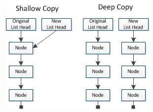

# 变量 数据类型 列表

## 1. 变量

变量（variable）是数据的容器，程序是数据的处理器

- Python 不把值储存在变量中，而是给变量贴标签
- Python 使用缩进来组织代码块，请务必坚持使用 4 个空格的缩进

|             命令             |     功能     |
| :--------------------------: | :----------: |
|       `type(variable)`       |   变量类型   |
| `isinstance(variable, type)` | 判断变量类型 |
|        `id(variable)`        |   变量地址   |

### 1.1. 命名规则

Python 程序是大小写敏感的，且变量名不能以数字开头。命名有如下形式：

- 驼峰命名（camel case）: 如，`myName`、`FirstName`
- 蛇形命名（snake case）: 如，`send_message`

## 2. 字符串

### 2.1. 在字符串中使用变量

```py3
first_name = "ada"
last_name = "lovelace"
print(first_name + " " + last_name)
print(f"{first_name}    {last_name}")
```

shell 命令中的变量使用方法和这歌f-string类似

这种字符串名为 f 字符串 。f 是 format(设置格式)的简写,因为 Python 通过把花括号内的变量替换为其值来设置字符串的格式。

```py3
first_name = "ada"
last_name = "lovelace"
full_name = first_name + "" + last_name
print(f"Hello,{full_name.title()}!")
```

撇号位于两个双引号之间,因此 Python 解释器能够正确地理解这个字符串

## 3. 数 常量

数中下划线：

```py3
universe_age = 14_000_000_000
print(universe_age)
```

同时给多个变量赋值可在一行代码中给多个变量赋值,这有助于缩短程序并提高其可读性。这种做法最常用于将一系列数赋给一组变量。
例如,下面演示了如何将变量 x 、y 和 z 都初始化为零

```py3
x,y,z = 0,0,0
```

## 4. Python 数据类型


## 5. 注释

- `#` 为单行注释符，解释器不读取
- `"""..."""` 为多行注释符，解释器会当作字符串读取，应尽力避免过多


# 列表

列表让你能够在一个地方存储成组的信息,其中可以只包含几个元素,也可以包含数百万个元素。列表是新手可直接使用的最强大的 Python 功能之一,它融合了众多重要的编程概念。

## 1. 列表是什么

列表由一系列按特定顺序排列的元素组成。

```py3
bicycles = ['trek', 'cannondale', 'redline', 'specialized']
print(bicycles)
```

访问列表元素列表是有序集合,因此要访问列表的任意元素,只需将该元素的位置(索引 )告诉 Python 即可。要访问列表元素,可指出列表的名称,再指出元素的索引,并将后者放在方括号内。

```py3
bicycles = ['trek', 'cannondale', 'redline', 'specialized']
bicycles[0]
```

索引从 0 而不是 1 开始在 Python 中,第一个列表元素的索引为 0,而不是 1。

## 2. 修改、添加和删除元素

```py3
motorcycles = ['honda', 'yamaha', 'suzuki']
motorcycles[0] = 'ducati'
print(motorcycles)
```

append 添加元素

```py3
motorcycles = [] # 声明变量类型为列表
motorcycles.append('honda')
motorcycles.append('yamaha')
motorcycles.append('suzuki')
print(motorcycles)
```

使用方法 insert() 可在列表的任何位置添加新元素

```py3
motorcycles = ['honda', 'yamaha', 'suzuki']
motorcycles.insert(2,'ducati')
print(motorcycles)
```

从列表中删除元素

```py3
motorcycles = ['honda', 'yamaha', 'suzuki']
del motorcycles[0]
del motorcycles[1]
print(motorcycles)
```

使用方法 pop() 删除元素

方法 pop() 删除列表末尾的元素,并让你能够接着使用它。

- **术语弹出 (pop)源自这样的类比:列表就像一个栈,而删除列表末尾的元素相当于弹出栈顶元素**。

```py3
motorcycles = ['honda', 'yamaha', 'suzuki']
print(motorcycles)
popped_motorcycle = motorcycles.pop()
print(motorcycles)
print(popped_motorcycle)
```

pop 弹出任意位置

```py3
motorcycles = ['honda', 'yamaha', 'suzuki']
first_owned = motorcycles.pop(0)
print(f"The first motorcycle I owned was a {first_owned.title()}")
```

## 3. 组织列表

- sort() 字母顺序，**永久改变**

- sorted() 字母顺序，**创建一个排序的副本**

```py3
cars = ['bmw', 'audi', 'toyota', 'subaru']
cars.sort()
print(cars)
cars.sort(reverse=True)
print(cars)
```

```py3
cars = ['bmw', 'audi', 'toyota', 'subaru']
print(cars)
print(sorted(cars))
print(cars)
```

reverse() 反转列表

```py3
cars = ['bmw', 'audi', 'toyota', 'subaru']
print(cars)
cars.reverse()
print(cars)
```

## 4. 使用列表时避免索引错误

- **索引是从 0 开始的**

```py3
motorcycles = ['honda', 'yamaha', 'suzuki']
print(motorcycles[3])
```

```py3
motorcycles = ['honda', 'yamaha', 'suzuki']
print(motorcycles[-1])
```

## 5. 遍历整个列表

```py3
magicians = ['alice', 'david', 'carolina']
for mg in magicians:
    print(mg)
```

```py3
magicians = ['alice', 'david', 'carolina']
for mg in magicians:
    print(f"{mg.title()}, that was a great trick!")
```

```py3
magicians = ['alice', 'david', 'carolina']
for magician in magicians:
    print(f"{magician.title()}, that was a great trick!")
    print(f"I can't wait to see your next trick, {magician.title()}.\n")
```

在 for 循环结束后执行一些操作

```py3
magicians = ['alice', 'david', 'carolina']
for magician in magicians:
    print(f"{magician.title()}, that was a great trick!")
    print(f"I can't wait to see your next trick, {magician.title()}.\n")
print("Thank you, everyone. That was a great magic show!")
```

## 6. 避免缩进错误

Python 根据缩进来判断代码行与前一个代码行的关系。在前面的示例中,向各位魔术师显示消息的代码行是 for 循环的一部分,因为它们缩进了。Python 通过使用缩进让代码更易读。简单地说,它要求你使用缩进让代码整洁而结构清晰。在较长的 Python 程序中,你将看到缩进程度各不相同的代码块,从而对程序的组织结构有大致的认识。

开始编写必须正确缩进的代码时,需要注意一些常见的缩进错误 。例如,程序员有时候会将不需要缩进的代码块缩进,而对于必须缩进的代码块却忘了缩进。查看这样的错误示例有助于你以后避开它们,以及在它们出现在程序中时进行修复。

忘记缩进额外的代码行

```py3
magicians = ['alice', 'david', 'carolina']
for magician in magicians:
    print(f"{magician.title()}, that was a great trick!")
print(f"I can't wait to see your next trick, {magician.title()}.\n")
```

```py3
magicians = ['alice', 'david', 'carolina']
for magician in magicians:
    print(f"{magician.title()}, that was a great trick!")
    print(f"I can't wait to see your next trick, {magician.title()}.\n")
    print("Thank you, everyone. That was a great magic show!")
```

```py3
flavs = ['sausage', 'pepperoni', 'ham']
for flav in flavs:
    print(f"I like {flav} pizza.")
print("I really love pizza!")
```

## 7. 创建数值列表

列表非常适合用于存储数字集合,而 Python 提供了很多工具,可帮助你高效地处理数字列表。明白如何有效地使用这些工具后,即便列表包含数百万个元素,你编写的代码也能运行得很好

### 7.1. 使用函数 range()

1 到 10 但是不会打印 10

```py3
for value in range(1,10):
    print(value)
```

要到 11:

```py3
for value in range(1,11):
    print(value)
```

### 7.2. 使用 range() 创建数字列表

```py3
numbers = list(range(1,6))
print(numbers)
```

输出等差数列：

```py3
even_numbers = list(range(2,11,2))
print(even_numbers)
```

```py3
sqrs= []
for value in range(1,11):
    sqrs.append(value ** 2)
print(sqrs)
```

### 7.3. 对数字列表执行简单的统计计算

```py3
digits = [1, 2, 3, 4, 5, 6, 7, 8, 9, 0]
min = min(digits)
max = max(digits)
sum = sum(digits)

print(f"The minimum value in the list is {min}.\nThe maximum value in the list is {max}.\nThe sum of all the values in the list is {sum}.")
```

### 7.4. **列表解析**

前面介绍的生成列表 squares 的方式包含三四行代码,而列表解析让你**只需编写一行代码就能生成这样的列表**。

列表解析 将 for 循环和创建新元素的代码合并成一行,并自动附加新元素。

```py3
sqrs = [value ** 2 for value in range(1,11)]
print(sqrs)
```

```py3
digits = list(range(1,1000001))
min = min(digits)
max = max(digits)
sum = sum(digits)
print(f"The minimum value in the list is {min}.\nThe maximum value in the list is {max}.\nThe sum of all the values in the list is {sum}.")
```

```py3
cubics = [value ** 3 for value in range(1,11)]
print(cubics)
```

## 8. 使用列表的一部分

处理列表的部分元素,Python 称之为切片。

### 8.1. 切片

```py3
players = ['charles', 'martina', 'michael', 'florence', 'eli']
print(players[0:3])
print(players[:2])
print(players[2:])
print(players[-3:])
```

### 8.2. 遍历切片

如果要遍历列表的部分元素,可在 for 循环中使用切片。下面的示例遍历前三名队员,并打印他们的名字:

```py3
players = ['charles', 'martina', 'michael', 'florence', 'eli']
print("Here are the first three players on my team:")
for player in players[:3]:
    print(player.upper())
```

### 8.3. 复制列表

我们经常需要根据既有列表创建全新的列表。下面来介绍复制列表的工作原理,以及复制列表可提供极大帮助的一种情形。

要复制列表,可创建一个包含整个列表的切片,方法是同时省略起始索引和终止索引(`[:]` )。

这让 Python 创建一个始于第一个元素、终止于最后一个元素的切片, 即整个列表的副本.

```py3
my_foods = ['pizza', 'falafel', 'carrot cake']
ur_foods = my_foods[:]

print(f"My favorite foods are: {my_foods} .\nAnd my friends favorite foods are: {ur_foods}.")
```

```py3
my_foods = ['pizza', 'falafel', 'carrot cake']
ur_foods = my_foods[:]

my_foods.append('cannoli')
ur_foods.append('ice cream')

print(f"My favorite foods are: {my_foods} .\nAnd my friends favorite foods are: {ur_foods}.")
```

## 9. 元组

列表非常适合用于存储在程序运行期间可能变化的数据集。

### 9.1. 列表是可以修改的,但是元组是不可以修改的

创建一系列不可修改的元素,元组可以满足这种需求.Python 将不能修改的值称为不可变的 ,而不可变的列表被称为元组

### 9.2. 定义元组

元组看起来很像列表,但使用**圆括号而非中括号来标识**。

- **元组 圆括号**

定义元组后,就可使用索引来访问其元素,就像访问列表元素一样。

例如,如果有一个大小不应改变的矩形,可将其长度和宽度存储在一个元组中,从而确保它们是不能修改的:

```py3
dimensions = (200,50)
print(dimensions[0])
print(dimensions[1])
```

试图修改元组的操作是被禁止的,因此 Python 指出不能给元组的元素赋值:

```py3
dimensions = (200,50)
dimensions[0] = 100
```

`TypeError: 'tuple' object does not support item assignment`

### 9.3. 遍历元组中的所有值

像列表一样,也可以使用 for 循环来遍历元组中的所有值:

```py3
dimensions = (200,50,21,30)
for dm in dimensions:
    print(dm)
```

### 9.4. 修改元组变量

虽然不能修改元组的元素,但可以给存储元组的变量赋值,可**重新定义整个元组**

```py3
dimensions = (200,50,21,30)
print(f"Original dimensions: {dimensions}")
dimensions = (200,50)
print(f"Modified dimensions: {dimensions}")
```

```py3
buffet = ('pizza', 'falafel', 'carrot cake')
for food in buffet:
    print(food)
```

## 10. 设置代码格式

让你的代码尽可能易于阅读。这有助于你掌握程序是做什么的,也可以帮助他人理解你编写的代码。

### 10.1. 格式设置指南

要提出 Python 语言修改建议,需要编写 Python 改进提案 (Python Enhancement Proposal,PEP)。

[Python PEP8 — the Style Guide for Python Code](https://pythonmana.com/2021/12/202112181115286623.html)

PEP 8 是最古老的 PEP 之一,向 Python 程序员提供了代码格式设置指南。PEP 8 的篇幅很长,但基本上与复杂的编码结构相关。

代码被阅读的次数比编写的次数多。代码编写出来后,调试时需要阅读;给程序添加新功能时,需要花很长的时间阅读;与其他程序员分享代码时,这些程序员也会阅读。

### 10.2. 缩进

PEP 8 建议每级缩进都使用四个空格。

- 不要 混合使用制表符和空格。

这既可提高可读性,又留下了足够的多级缩进空间。

### 10.3. 行长

很多 Python 程序员建议每行不超过 80 字符。

PEP 8 还建议注释的行长不应超过 72 字符,因为有些工具为大型项目自动生成文档时,会在每行注释开头添加格式化字符。

### 10.4. 空行

要将程序的不同部分分开,可使用空行。

你应该使用空行来组织程序文件,但也不能滥用。

- 例如,如果你有五行创建列表的代码,还有三行处理该列表的代码,那么用一个空行将这两部分隔开是合适的。然而,你不应使用三四个空行将其隔开。

空行不会影响代码的运行,但会影响代码的可读性。

Python 解释器根据水平缩进情况来解读代码,但不关心垂直间距。

## 11. 小结

如何高效地处理列表中的元素;如何使用 for 循环遍历列表,Python 如何根据缩进来确定程序的结构,以及如何避免一些常见的缩进错误; 如何创建简单的数字列表,以及可对数字列表执行的一些操作;如何通过切片来使用列表的一部分和复制列表。

元组(它对不应变化的值提供了一定程度的保护),以及在代码变得越来越复杂时如何设置格式,使其易于阅读。

## 12. Skills

### 12.1. `-＞ List[int]` 的含义

**Python 函数声明中-＞ List[int]的含义**

    Solution:
        def twoSum(self, nums: List[int], target: int) -> List[int]:

这是 3.5 版中的新功能。您可以查看[文档](https://docs.python.org/3.5/library/typing.html)。

这就是所谓的“类型提示”（或“功能注释”；这些功能自 Python 3.0 起可用）。

    -> List[int] 表示该函数应返回一个整数列表。
    nums: List[int], target: int表示应该nums是整数列表，并且应该target是整数。

但是，这并不是硬性要求，即您仍然可以使用传递给这些参数的不同类型的对象来调用该函数，并且该函数还可以返回不同于整数列表的某些内容（与 Java 等其他语言中提供错误类型的情况不同）会导致编译错误）。换句话说：类型提示与程序执行无关，它们在运行时会被忽略（忽略类型提示只是默认行为，但可以在运行时通过来使用它们**annotations**，因此您可以对它们进行处理）。

类型提示可以表达作者的意图，并且可以在程序执行之前通过 mypy 之类的工具进行检查（这些提示可以检查，例如，仅使用正确类型的参数调用函数并返回正确类型的东西）。

请注意，List 它在标准名称空间中不可用（不同于 list），而是需要从中导入 typing，

提供其它类型的标准类型，例如 Set，Dict，Tuple，Callable 等。
允许定义自己的类型
提供其他类型的类型化版本，例如 NamedTuple 代替 namedtuple

### 12.2. copy — Shallow and deep copy

- 浅拷贝（shallowCopy）只是增加了一个指针指向已存在的内存地址，
- 深拷贝（deepCopy）是增加了一个指针并且申请了一个新的内存，使这个增加的指针指向这个新的内存，
  - 使用深拷贝的情况下，释放内存的时候不会因为出现浅拷贝时释放同一个内存的错误。


