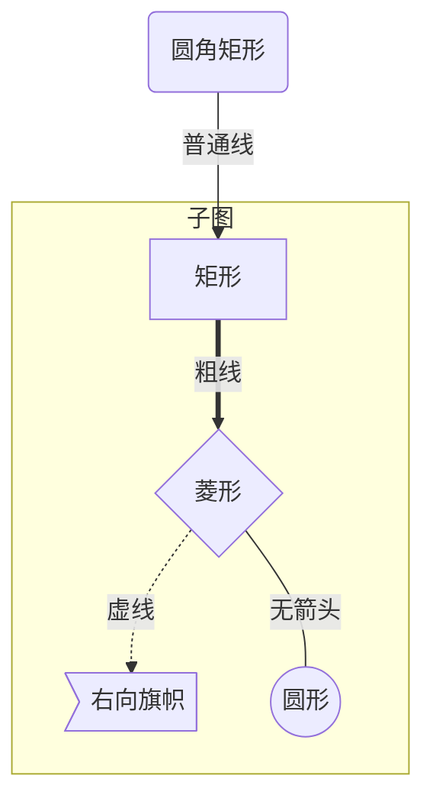
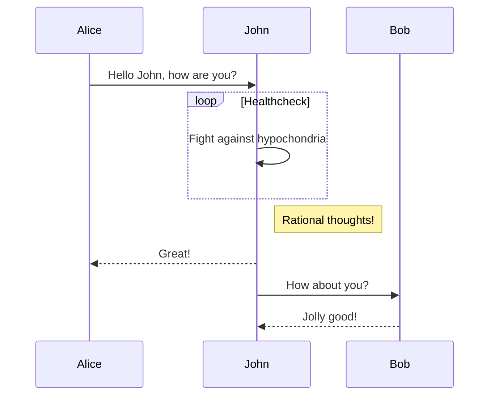
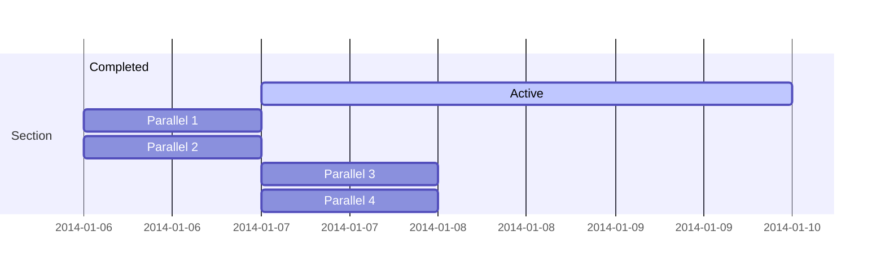
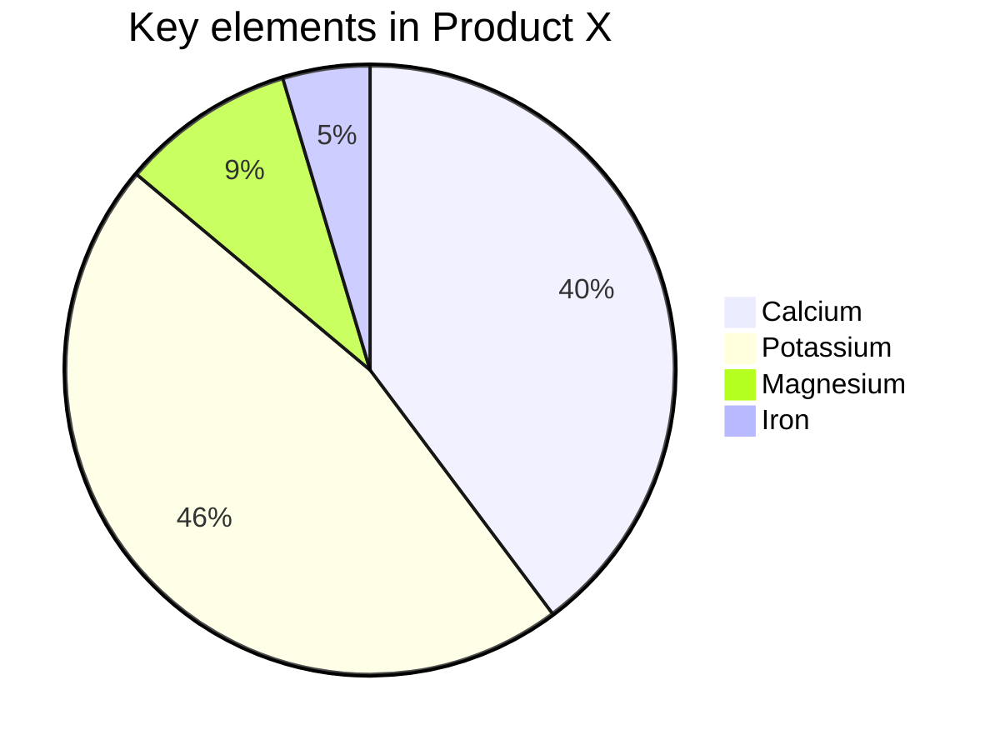
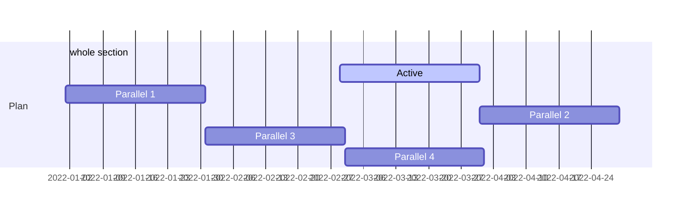

# [Mermaid 教程](https://zhuanlan.zhihu.com/p/139166407)

## 流程图




| 用词 | 含义     |
| ---- | -------- |
| TB   | 从上到下 |
| BT   | 从下到上 |
| RL   | 从右到左 |
| LR   | 从左到右 |

- 节点定义

| 表述       | 说明           |
| ---------- | -------------- |
| id[文字]   | 矩形节点       |
| id(文字)   | 圆角矩形节点   |
| id((文字)) | 圆形节点       |
| id>文字]   | 右向旗帜状节点 |
| id{文字}   | 菱形节点       |

- 节点连线

| 表述     | 说明           |
| -------- | -------------- |
| >        | 添加尾部箭头   |
| -        | 不添加尾部箭头 |
| --       | 单线           |
| --text-- | 单线上加文字   |
| ==       | 粗线           |
| ==text== | 粗线加文字     |
| -.-      | 虚线           |
| -.text.- | 虚线加文字     |

## 时序图



## Gantt 图






```mermaid
erDiagram
CUSTOMER ||--o{ORDER : places
ORDER ||--|{LINE-ITEM : contains
CUSTOMER}|..|{DELIVERY-ADDRESS : uses

erDiagram
  CUSTOMER ||--o{ORDER : places
  ORDER ||--|{LINE-ITEM : contains
  CUSTOMER}|..|{DELIVERY-ADDRESS : uses
```



