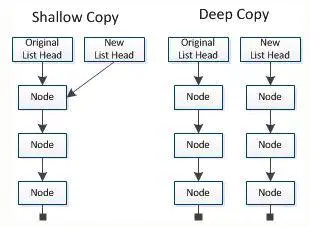

# 第 4 章 操作列表

遍历 整个列表

循环让你能够对列表的每个元素都采取一个或一系列相同的措施

## 遍历整个列表

```python
magicians = ['alice', 'david', 'carolina']
for mg in magicians:
    print(mg)
```

```python
magicians = ['alice', 'david', 'carolina']
for mg in magicians:
    print(f"{mg.title()}, that was a great trick!")
```

```python
magicians = ['alice', 'david', 'carolina']
for magician in magicians:
    print(f"{magician.title()}, that was a great trick!")
    print(f"I can't wait to see your next trick, {magician.title()}.\n")
```

在 for 循环结束后执行一些操作

```python
magicians = ['alice', 'david', 'carolina']
for magician in magicians:
    print(f"{magician.title()}, that was a great trick!")
    print(f"I can't wait to see your next trick, {magician.title()}.\n")
print("Thank you, everyone. That was a great magic show!")
```

## 避免缩进错误

Python 根据缩进来判断代码行与前一个代码行的关系。在前面的示例中,向各位魔术师显示消息的代码行是 for 循环的一部分,因为它们缩进了。Python 通过使用缩进让代码更易读。简单地说,它要求你使用缩进让代码整洁而结构清晰。在较长的 Python 程序中,你将看到缩进程度各不相同的代码块,从而对程序的组织结构有大致的认识。

开始编写必须正确缩进的代码时,需要注意一些常见的缩进错误 。例如,程序员有时候会将不需要缩进的代码块缩进,而对于必须缩进的代码块却忘了缩进。查看这样的错误示例有助于你以后避开它们,以及在它们出现在程序中时进行修复。

忘记缩进额外的代码行

```python
magicians = ['alice', 'david', 'carolina']
for magician in magicians:
    print(f"{magician.title()}, that was a great trick!")
print(f"I can't wait to see your next trick, {magician.title()}.\n")
```

```python
magicians = ['alice', 'david', 'carolina']
for magician in magicians:
    print(f"{magician.title()}, that was a great trick!")
    print(f"I can't wait to see your next trick, {magician.title()}.\n")
    print("Thank you, everyone. That was a great magic show!")
```

```python
flavs = ['sausage', 'pepperoni', 'ham']
for flav in flavs:
    print(f"I like {flav} pizza.")
print("I really love pizza!")
```

## 创建数值列表

列表非常适合用于存储数字集合,而 Python 提供了很多工具,可帮助你高效地处理数字列表。明白如何有效地使用这些工具后,即便列表包含数百万个元素,你编写的代码也能运行得很好

### 使用函数 range()

1 到 10 但是不会打印 10

```python
for value in range(1,10):
    print(value)
```

要到 11:

```python
for value in range(1,11):
    print(value)
```

### 使用 range() 创建数字列表

```python
numbers = list(range(1,6))
print(numbers)
```

输出等差数列：

```python
even_numbers = list(range(2,11,2))
print(even_numbers)
```

```python
sqrs= []
for value in range(1,11):
    sqrs.append(value ** 2)
print(sqrs)
```

### 对数字列表执行简单的统计计算

```python
digits = [1, 2, 3, 4, 5, 6, 7, 8, 9, 0]
min = min(digits)
max = max(digits)
sum = sum(digits)

print(f"The minimum value in the list is {min}.\nThe maximum value in the list is {max}.\nThe sum of all the values in the list is {sum}.")
```

### **列表解析**

前面介绍的生成列表 squares 的方式包含三四行代码,而列表解析让你**只需编写一行代码就能生成这样的列表**。

列表解析 将 for 循环和创建新元素的代码合并成一行,并自动附加新元素。

```python
sqrs = [value ** 2 for value in range(1,11)]
print(sqrs)
```

```python
digits = list(range(1,1000001))
min = min(digits)
max = max(digits)
sum = sum(digits)
print(f"The minimum value in the list is {min}.\nThe maximum value in the list is {max}.\nThe sum of all the values in the list is {sum}.")
```

```python
cubics = [value ** 3 for value in range(1,11)]
print(cubics)
```

## 使用列表的一部分

处理列表的部分元素,Python 称之为切片。

### 切片

```python
players = ['charles', 'martina', 'michael', 'florence', 'eli']
print(players[0:3])
print(players[:2])
print(players[2:])
print(players[-3:])
```

### 遍历切片

如果要遍历列表的部分元素,可在 for 循环中使用切片。下面的示例遍历前三名队员,并打印他们的名字:

```python
players = ['charles', 'martina', 'michael', 'florence', 'eli']
print("Here are the first three players on my team:")
for player in players[:3]:
    print(player.upper())
```

### 复制列表

我们经常需要根据既有列表创建全新的列表。下面来介绍复制列表的工作原理,以及复制列表可提供极大帮助的一种情形。

要复制列表,可创建一个包含整个列表的切片,方法是同时省略起始索引和终止索引(`[:]` )。

这让 Python 创建一个始于第一个元素、终止于最后一个元素的切片, 即整个列表的副本.

```python
my_foods = ['pizza', 'falafel', 'carrot cake']
ur_foods = my_foods[:]

print(f"My favorite foods are: {my_foods} .\nAnd my friends favorite foods are: {ur_foods}.")
```

```python
my_foods = ['pizza', 'falafel', 'carrot cake']
ur_foods = my_foods[:]

my_foods.append('cannoli')
ur_foods.append('ice cream')

print(f"My favorite foods are: {my_foods} .\nAnd my friends favorite foods are: {ur_foods}.")
```

## 元组

列表非常适合用于存储在程序运行期间可能变化的数据集。

### 列表是可以修改的,但是元组是不可以修改的

创建一系列不可修改的元素,元组可以满足这种需求.Python 将不能修改的值称为不可变的 ,而不可变的列表被称为元组

### 定义元组

元组看起来很像列表,但使用**圆括号而非中括号来标识**。

- **元组 圆括号**

定义元组后,就可使用索引来访问其元素,就像访问列表元素一样。

例如,如果有一个大小不应改变的矩形,可将其长度和宽度存储在一个元组中,从而确保它们是不能修改的:

```python
dimensions = (200,50)
print(dimensions[0])
print(dimensions[1])
```

试图修改元组的操作是被禁止的,因此 Python 指出不能给元组的元素赋值:

```python
dimensions = (200,50)
dimensions[0] = 100
```

`TypeError: 'tuple' object does not support item assignment`

### 遍历元组中的所有值

像列表一样,也可以使用 for 循环来遍历元组中的所有值:

```python
dimensions = (200,50,21,30)
for dm in dimensions:
    print(dm)
```

### 修改元组变量

虽然不能修改元组的元素,但可以给存储元组的变量赋值,可**重新定义整个元组**

```python
dimensions = (200,50,21,30)
print(f"Original dimensions: {dimensions}")
dimensions = (200,50)
print(f"Modified dimensions: {dimensions}")
```

```python
buffet = ('pizza', 'falafel', 'carrot cake')
for food in buffet:
    print(food)
```

## 设置代码格式

让你的代码尽可能易于阅读。这有助于你掌握程序是做什么的,也可以帮助他人理解你编写的代码。

### 格式设置指南

要提出 Python 语言修改建议,需要编写 Python 改进提案 (Python Enhancement Proposal,PEP)。

[Python PEP8 — the Style Guide for Python Code](https://pythonmana.com/2021/12/202112181115286623.html)

PEP 8 是最古老的 PEP 之一,向 Python 程序员提供了代码格式设置指南。PEP 8 的篇幅很长,但基本上与复杂的编码结构相关。

代码被阅读的次数比编写的次数多。代码编写出来后,调试时需要阅读;给程序添加新功能时,需要花很长的时间阅读;与其他程序员分享代码时,这些程序员也会阅读。

### 缩进

PEP 8 建议每级缩进都使用四个空格。

- 不要 混合使用制表符和空格。

这既可提高可读性,又留下了足够的多级缩进空间。

### 行长

很多 Python 程序员建议每行不超过 80 字符。

PEP 8 还建议注释的行长不应超过 72 字符,因为有些工具为大型项目自动生成文档时,会在每行注释开头添加格式化字符。

### 空行

要将程序的不同部分分开,可使用空行。

你应该使用空行来组织程序文件,但也不能滥用。

- 例如,如果你有五行创建列表的代码,还有三行处理该列表的代码,那么用一个空行将这两部分隔开是合适的。然而,你不应使用三四个空行将其隔开。

空行不会影响代码的运行,但会影响代码的可读性。

Python 解释器根据水平缩进情况来解读代码,但不关心垂直间距。

## 小结

如何高效地处理列表中的元素;如何使用 for 循环遍历列表,Python 如何根据缩进来确定程序的结构,以及如何避免一些常见的缩进错误; 如何创建简单的数字列表,以及可对数字列表执行的一些操作;如何通过切片来使用列表的一部分和复制列表。

元组(它对不应变化的值提供了一定程度的保护),以及在代码变得越来越复杂时如何设置格式,使其易于阅读。

## Skills

### `-＞ List[int]` 的含义

**Python 函数声明中-＞ List[int]的含义**

    Solution:
        def twoSum(self, nums: List[int], target: int) -> List[int]:

这是 3.5 版中的新功能。您可以查看[文档](https://docs.python.org/3.5/library/typing.html)。

这就是所谓的“类型提示”（或“功能注释”；这些功能自 Python 3.0 起可用）。

    -> List[int] 表示该函数应返回一个整数列表。
    nums: List[int], target: int表示应该nums是整数列表，并且应该target是整数。

但是，这并不是硬性要求，即您仍然可以使用传递给这些参数的不同类型的对象来调用该函数，并且该函数还可以返回不同于整数列表的某些内容（与 Java 等其他语言中提供错误类型的情况不同）会导致编译错误）。换句话说：类型提示与程序执行无关，它们在运行时会被忽略（忽略类型提示只是默认行为，但可以在运行时通过来使用它们**annotations**，因此您可以对它们进行处理）。

类型提示可以表达作者的意图，并且可以在程序执行之前通过 mypy 之类的工具进行检查（这些提示可以检查，例如，仅使用正确类型的参数调用函数并返回正确类型的东西）。

请注意，List 它在标准名称空间中不可用（不同于 list），而是需要从中导入 typing，

    提供其它类型的标准类型，例如Set，Dict，Tuple，Callable等。
    允许定义自己的类型
    提供其他类型的类型化版本，例如NamedTuple代替namedtuple

### copy — Shallow and deep copy

- 浅拷贝（shallowCopy）只是增加了一个指针指向已存在的内存地址，
- 深拷贝（deepCopy）是增加了一个指针并且申请了一个新的内存，使这个增加的指针指向这个新的内存，
  - 使用深拷贝的情况下，释放内存的时候不会因为出现浅拷贝时释放同一个内存的错误。


