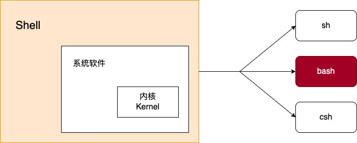

# Part 1 [变量](https://zhuanlan.zhihu.com/p/461544335)

## 1. 基本概念



- Kernel
  - Linux 内核主要是为了和硬件打交道
- Shell
  - 命令解释器(command interpreter)
  - Shell 是一个用 C 语言编写的程序，它是用户使用 Linux 的桥梁。Shel‖既是一种命令语言，又是一种程序设计语言。
  - Shell 是指一种应用程序，这个应用程序提供了一个界面，用户通过这个界面访问操作系统内核的服务。
- shell 两大主流：
  - sh:(基本上都这个)
    - Bourne shell(sh),Solaris,hpux 默认 shell
    - Bourne again shell(bash),**Linux 系统默认 shell**。写脚本尽量声明成 bash。
  - csh:
    - C shell(csh)
    - tc shell(tcsh)

### 1.1. 注释

- 单行注释：`#`
- 多行注释

```bash
<<EOS
  This is a multi-line comment.
EOS
```

### 1.2. 变量类型

变量类型运行 Shell 时，会同时存在三种变量：

- 局部变量：局部变量在脚本或命令中定义，仅在当前 Shell 实例中有效，其他 Shell 启动的程序不能访问局部变量。
- 环境变量（全局变量）：所有的程序，包括 Shell 启动的程序，都能访问的变量。必要的时候 Shell 脚本也可以定义环境变量。
- Shell 变量：由 Shell 程序设置的特殊变量。

### 1.3. 变量操作

- 创建 & 删除

```bash
# 普通变量
# =两边不可有空格
name="test"

# 局部变量
local name="test"
# 只读变量，不可被修改
readonly name

# 环境变量
export name
# 查询环境变量
env

# 删除变量
unset name
```

- 调用

```bash
echo $name
# 推荐使用大括号版
echo ${name}
```

### 变量的作用域

## 2. 字符串

- 引号

```bash
# 单引号变量只能原样输出，不能出现转义符
var='test'
# 双引号变量可出现转义符
var="my name is ${name}"
```

### 2.1. 内置方法

- 获取长度

```bash
name="test";
echo ${#name}; # 4
```

- 切片

```bash
name="this is my name";
echo ${name:1:4} # is i
echo ${name::4} # this
```

### 2.2. 拼接

拼接中间无任何 `+` 之类的字符，以下语句等效（与引号类型无关）

```bash
name="this is"" my name"
name="this is my name"
name="this" is "my name"
```

利用括号表达式

```bash
# 两端拼接
echo x{Hello, World}x
# echo xHellox Worldx

# 分别拼接
cp some_file{,bak}
# cp some_file some_file.bak

mv x/{before,after}/asdf/file
# mv x/before/asdf/file x/after/asdf/file

touch {a,b,c}.{rs,cpp}
# touch a.rs a.cpp b.rs b.cpp c.rs c.cpp

git add {main, x{1,2}}.rs
# git add main.rs xl.rs x2.rs
```

### 2.3. 批量生成

```bash
# 对数值字符串
rm d{01..20}/file
# rm d01/file d02/file d03/file d04/file....

# 对单字母字符串
cat {a..f}.txt
# cat a. txt b. txt c. txt d. txt e. txt f. txt
```

### 2.4. 测试

```bash
# 测试字符串为空
if [[ -z "${my_var}" ]]; then
    do_something
fi

# 测试字符串非空
if [[ -n "${my_var}" ]]; then
    do_something
fi
```

## 3. 数组

bash 只支持一维数组，不支持多维数组

```bash
array=(li la le)
array_name[0]="lo";

# 元素个数
${#array_name[@]}
# 单个元素长度
${#array_name[1]}
```

## 4. 关系运算符

成立返回 true。

- `[ ]`：中括号旁边和运算符两边必须添加空格（可以使用，不推荐）
- `[[]]`：中括号旁边和运算符两边必须添加空格（字符串验证时，推荐使用）
- `(())`：中括号旁边和运算符两边必须添加空格（数字验证时，推荐使用）

### 4.1. 数值运算符

关系运算符只支持数字，不支持字符串，除非字符串的值是数字。

- `-eq`：检测两个数是否相等。
- `-ne`：检测两个数是否不相等。
- `-gt`：检测左边的数是否大于右边。
- `-lt`：检测左边的数是否小于右边的
- `-ge`：检测左边的数是否大于等于右边的
- `-le`：检测左边的数是否小于等于右边的

```bash
$[a + b]
$(($a + $b))
```

### 4.2. 字符串运算符

- `=`：检测两个字符串是否相等
- `!=`：检测两个字符串是否相等
- `-z`：检测字符串长度是否为 0
- `-n`：检测字符串长度是否为 0
- `$`：检测字符串是否为空

### 4.3. 布尔运算符

- `!`：非运算
- `-o`：或运算
- `-a`：与运算

### 4.4. 逻辑运算符

- `&&`：逻辑的 AND
- `||`：逻辑的 OR

### 4.5. 文件运算符

- `-b file`：检测文件是否是块设备文件。
- `-c file`：检测文件是否是字符设备文件。
- `-d file`：检测文件是否是目录。
- `-f file`：检测文件是否是普通文件（非目录或是设备文件）。
- `-g file`：检测文件是否设置了 SGID 位。
- `-k file`：检测文件是否设置了粘着位。
- `-p file`：检测文件是否是有名管道。
- `-u file`：检测文件是否设置了 SUID 位。
- `-r file`：检测文件是否可读。
- `-w file`：检测文件是否可写。
- `-x file`：检测文件是否可执行。
- `-s file`：检测文件是否为空（大小是否大于 0）。
- `-e file`：检测文件（包括目录）是否存在。

## 5. 执行相关

### 5.1. 输出

- `echo` 仅用于字符串的输出
- `printf` 作为输出的移植性好，建议使用
  - 不会像 `echo` 自动添加换行符，可以手动添加 `\n`

```bash
# printf format-string [arguments...]
printf "%-10s %-8s %-4.2f\n"
```

- d：十进制整数，对应位置参数必须是十进制整数，否则报错
- c：字符，对应位置参数必须是字符串或者字符型
- s：字符串，对应位置参数必须是字符串或者字符型
  - -10s：指一个宽度为 10 个字符（-表示左对齐，没有则表示右对齐），如果不足 10 个则自动以空格填充。
- f：浮点，对应位置参数必须是数字型
  - -4.2f：指格式化为小数，宽度为 4 个字符，.2 指保留 2 位小数。

### 5.2. 重定向

- 文件描述符
  - 0：stdin（标准输入）
  - 1：stdout（标准输出）
  - 2：stderr（标准错误）

```bash
# 获得命令的标准输出，标准错误依然会打印到屏幕上显示。
i=$(ls 123.txt)
# ls命令如果出现了错误提示，就会被重定向到/dev/null垃圾桶
i=$(ls 123.txt 2> /dev/null)
```

# Part 2 [控制流与函数](https://zhuanlan.zhihu.com/p/462831975)

## 1. 条件

### 1.1. if...else...

```bash
if condition1
then
    exec1
elif condition2
then
    exec2
else
    execn
fi
```

## 2. case...in...

```bash
case $name in
    a)  echo 'do a'
    ;;
    b)  echo 'do b'
    ;;
    *)  echo "don\'t do a nor b"
    ;;
esac
```

## 3. 循环

### 3.1. for...in...

```bash
for num in 1 2 3 4 5
do
  echo "The value is: $num"
done
```

```bash
for ((i=0; i<3; i++)); do
    touch test_${i}.txt
    echo "shell is easy" >> test_${i}.txt
done
```

### 3.2. while

```bash
while condition
do
  exec
done
```

## 4. 函数

### 4.1. 定义

```bash
# Single function
my_func() {
  action;

  [return int;]
}

# Part of a package
mypackage::my_func() {
  action;

  [return int;]
}
```

### 4.2. 参数

- 获取参数值：
  - $0： 固定，代表执行的文件名
  - $1 ： 代表传入的第 1 个参数
  - $n ： 代表传入的第 n 个参数
  - \$#：参数个数
  - \$\*： 以一个单字符串显示所有向脚本传递的参数。
  - \$@：与$\*相同，但是使用时加引号，并在引号中返回每个参数。
  - \$\$：脚本运行的当前进程号
  - \$：后台运行的最后一个进程的 ID
  - \$?： 显示最后命令的退出状态。0 表示没有错误，其他任何值表明有错误。

## 5. 文件与路径

```bash
if [-f /var/test.log]
then
  echo "File exts"
fi
```

## 6. 网络

- Install

```bash
curl -fsSL https://xxx/install.sh | sh
```

```powershell
iwr -useb https://xxx/install.ps1 | iex
```
